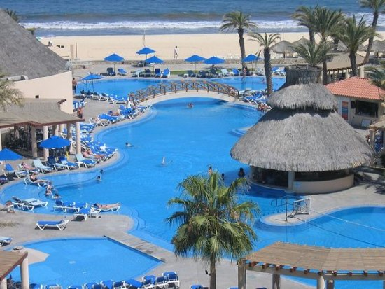
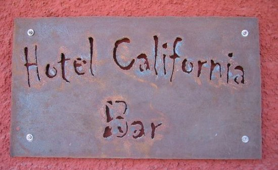

_This article was written after a May 2005 trip to Cabo San Lucas._ On the southern tip of Baja California is the region known as _Los Cabos_. This beautiful area which includes Cabo San Lucas and San Jose Del Cabo is just a short flight from Southern California. In a land best known for tequila, can one get a good cup of coffee? Prior to my Cabo visit, my only other Mexican coffee experience was an outstanding double espresso I had in Tijuana one Saturday afternoon, so I had hope. Unlike my journey through the American Southwest, I assumed a coffee-growing country like Mexico would have good coffee so I didn't bring any of my own. That was a mistake.  _Cabo San Lucas Arch_

### Royal Solaris Los Cabos

While in Mexico we stayed at the _Royal Solaris_ all-inclusive resort. Inside the resort, there were several restaurants and even a pool bar. Although it looked great, it didn't take too long to learn that despite the millions spent on this resort, they didn't have an espresso machine anywhere on the premises. All they had was some gross drip coffee that was still sitting on a burner hours after it was made. This was going to be a long week. If I were to survive, I'd have to discover coffee outside the resort.  _Royal Solaris Los Cabos_

### San Jose Del Cabo

Our resort was near nothing, so everything was either a bus ride, cab ride or long hike. Unless you want to sit around a pool all day drinking cheap skunked beer, I'd look for a resort closer to Cabo San Lucas. The two coffee places located near the resort were comically bad. I don't recall their names, which I'm sure they will be thankful for after reading this. One place neglected to train their employees to wipe down the frothing wand after making lattes. Leaving milk to dry on the frothing wand in the hot Mexican air is not a sanitary thing to do. I opted for the straight espresso. It was bitter and stale, but it was over quick. As I left, I watched the _barista_ use a plastic garbage can as a knock box for the espresso. With my caffeine deficiency under control, I could now focus on finding better coffee.

### Cabo San Lucas

If I were to find good coffee, it would have to be in Cabo San Lucas. One of the gifts I have is the ability to zone in on a quality coffee roaster without any prior knowledge of an area. While walking the streets of Cabo, I felt a magnetic pull towards the _Cabo Coffee Company_. By American standards it was equal to maybe an airport Starbucks, by Los Cabos standards it was _excellente_. They knew how to roast and make espresso. If they improved their espresso blend (it was a little one-dimensional), it would be even better. _The Cabo Coffee Company_ is the best coffee place in Los Cabos, Mexico.  _Cabo San Lucas Marina_ My hope was that after finding _The Cabo Coffee Company_ things would get better. Perhaps there were other places in Cabo San Lucas with equal or greater quality? No such luck. The second coffee place I went to was _The Italian Coffee Company_. Despite being part of the beautiful Puerto Paraiso Entertainment Plaza, this place had to be the worst of all the coffee places in Los Cabos. After ordering a double espresso, I was handed a soup bowl of over-extracted coffee. It must have been 12 ounces! _For those that don't order espresso, a double is around 2 ounces._ In some very rare cases, an espresso blend will taste decent when it's over poured. Not this time. I took one sip and handed it back. Then I got to hear a mini-lecture on how they made the drink correctly. Great. Not only was this place a disgrace to Mexico, it was a disgrace to Italy. They remade the drink using about 6 ounces of water. It was bitter and gross. The third coffee house we went to was the _San Francisco Coffee Company_. Maybe it was the name and the excellent location beside the Marina, but I really held out hope this would be the one. No such luck. The espresso was so over-roasted it tasted like charcoal. Adding to the unpleasant taste of my drink, the outside speaker was blasting some god-awful children's opera music. As much as I make fun of coffee houses playing Enya, I would have gladly listened to that over-played pseudo-Celtic music.

### Todos Santos

I'm not sure if this is considered part of the Los Cabos region, but it really doesn't matter. I didn't see a single coffee place in this sleepy town best known for the Hotel California. Although it shares the same name as the Eagles album, none of the band stayed here. According to _Snopes,_ it was a _coincidence of a shared name_.  _Hotel California Bar_

### Last Words

Mexico grows some excellent coffee, but when it comes to roasting and preparing it, the Los Cabos region needs help. The coffee houses of Los Cabos are a disgrace to the Mexican coffee farmers. In my 2003 article [Coffee on the Road - Grand Circle](/2009/05/coffee-on-the-road-grand-circle/ "Grand Canyon and more"), I invited coffee entrepreneurs to open up something decent on the south rim of the Grand Canyon. I am now extending the same challenge to the entire Los Cabos region. Setup a roaster, perfect your blends, train your employees and sell contracts to serve quality coffee to the many resorts. I'd like to return to Cabo San Lucas someday, but you can bet that, when I do, I'll be bringing my own coffee. I'll bring some home-roasted Mexican coffee and share it with the locals. Then they will know how good Mexican coffee can taste when it's fresh and roasted properly.