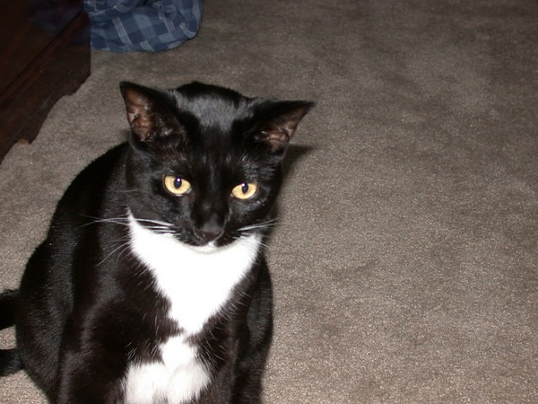

Just after 1 AM early this morning, our cat Kato died. A few months ago, she started losing a lot of weight and showed other signs of health problems. On 1/22/06, our vet Dr. H said she had a hyperthyroidism and that it could fixed with thyroid medicine. On the phone he stated it would run about $15-$20 a month. No problem. When I got there I was charged $40 for a 1 month supply. Something was off, so I inquired why the price difference. After a lot of talk between the staff and myself, Dr. H admitted he was going to give Kato a double dose for the first 30 days to get a quicker reaction. I pressed him if this was safe. He convinced me that it would be no problem for 30 days. At that time we could scale back the dosage if the blood work turned out OK. At no point was I told to look for any possible side effects. Dr. H assured me this level was safe. We didn't get 30 days. Kato went from being an active alert cat to a lethargic tired cat in the last week. By Thursday evening, she wasn't moving, she wasn't eating or drinking water. Then, last night, we noticed she was bleeding from the nose, so we took her to the emergency vet. After hours of having us wait and looking at blood work, the emergency vet found that the cat was not producing platelets in her blood and this was a side effect of large dosages of that thyroid medicine. Kato was bleeding behind her right eye by this time. She was losing a lot of blood and was in a lot of pain. The ER vet suggested some ghoulish life support ideas and at one point even thought we should take Kato home and hope she doesn't bleed to death that night. Faced with that option, we made a very tough decision to have her put down. We are sad at the loss of Kato and angered by the actions of both vets. Dr. H's heavy thyroid dosage brought Kato to the brink of death and the ER vet although "book smart" seemed to be lacking common sense or compassion.  We will be looking for a new vet for our other cat RainMan. Dr. H has been fired.