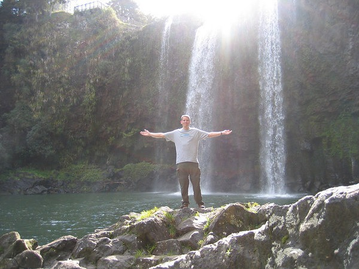
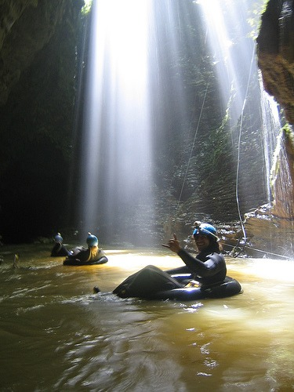

I'm back from my 11 day trip of New Zealand. The trip just covered the North Island. For all those people who said _why didn't you go to the South Island_? The answer is it is still winter in the South Island. New Zealanders told me that the best time to see the South Island is between November and March.  The quickest summary I can give about New Zealand is that New Zealand is the opposite of Brazil. Last month I learned that the [coffee and food of Brazil](/2006/08/rio-to-buenos-aires-overview/) is just awful. New Zealand not only has great food, but it serves the best coffee I've ever had in my life. The outdoor air quality of Rio De Janeiro was bad. The air quality of New Zealand is great. New Zealand's biggest weakness is Brazil's strength. Whereas the women of Brazil are hot, the New Zealand women mostly had short-cropped hair and looked very unfeminine. Overall New Zealand is a beautiful country. The detailed posts are coming soon.

### Day 1-4, 9-10 - Auckland

For the first half of the trip, I used Auckland as a home base. During the day we would travel outside the city. The first thing that struck me in Auckland was how good the coffee was. It was better than any place I've ever been to. Almost every cafe and restaurant has a professional espresso machine and staff trained on how to use it. Getting latte art was a normal occurrence. Although I fancy myself somewhat knowledgeable about coffee, I had to say that I learned quite a bit about coffee on this short trip.  When we weren't drinking espresso-based drinks, we made time to visit the [Sky Tower](https://en.wikipedia.org/wiki/Sky_Tower), which is the tallest free-standing structure in the Southern Hemisphere. 

### Day 2 - Whangarei Falls

### Day 3 - Coromandel

Coromandel is a peninsula east of Auckland. Once outside the city we were surprised the food and coffee were still outstanding. Unlike America, we saw no billboards as we drove through the countryside. 

### Day 4 - Rangitoto

Rangitoto is a volcanic island that we reached via a ferry boat from the port in Auckland. Once on the island, we hiked to the summit. The island was home to lava caves, one of which we climbed through.

### Day 5 - Whakarewarewa Thermal Village

Just outside of Rotorua, New Zealand was the Whakarewarewa Thermal Village. It was the first of two Thermal parks we would go to. If you’ve never seen steam pour up from the earth, it’s an amazing sight. It’s also an interesting smell. Some people say this area smells like rotten eggs. I found it more like the burning smell in the air after you see a fireworks display. 

### Day 6 - Wai-O-Tapu Thermal Wonderland

On Day 6 we went to the much better Wai-O-Tapu Thermal Wonderland. This was one amazing part of Earth to witness. 

### Day 6 - Hobbiton

America has Graceland, the North Island of New Zealand has Hobbiton. It was the filming location for _The Lord of the Rings: The Fellowship of the Ring_. Yes, we took the tour of the Hobbit village. This may be the geekiest thing I’ve ever done, even geekier than the time I stood in line to meet Hulk Hogan.  

### Day 8 - Taupo / Huka Falls

Day 7 we got rain, so we hiked the Huka Falls on Day 8. Yes, another waterfall. _Don’t go chasing waterfalls …_ From there we hit the road and drove to our only Bed and Breakfast – the Kauri Lodge. Having never been to a B&B, I wasn’t sure what to expect. It was a great experience. We stayed with a New Zealand couple that owned sheep, cattle, and even a racehorse. We learned a lot about New Zealand from them and I was able to give them some information for their upcoming trip to Cabo San Lucas. 

### Day 9 - Black Water Rafting

New Zealand seems to be the motherland of extreme sports. There were many opportunities to skydive or bungee. We passed on those but did decide to try Black Water Rafting. This is going through underground caves on an intertube and freezing cold water with only a miner’s helmet for light. At two points we had to do blind backward jumps off ledges into the underground current. Did I mention the water was freezing? The wet suit didn’t keep you warm. The photos taken by our tour group were lousy quality, so we didn’t buy the CD. 

### Day 9 - Tirau

On the way back to Auckland we passed through the town of Tirau which has metallic sculptures on many of its buildings. It’s quite the roadside attraction. 