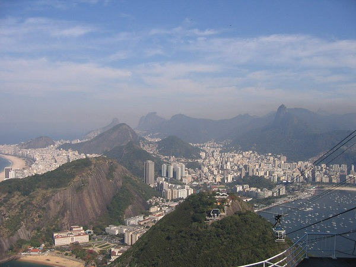
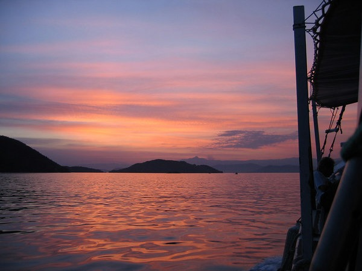
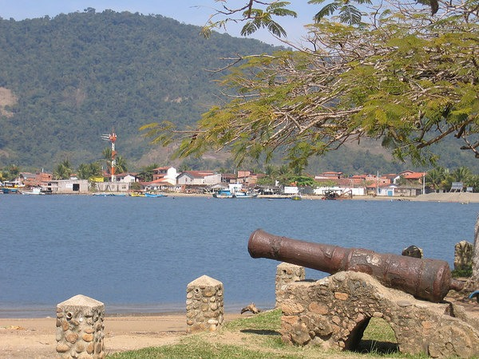
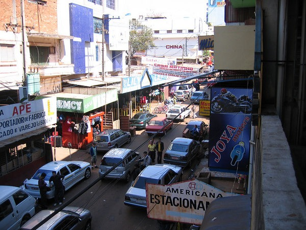
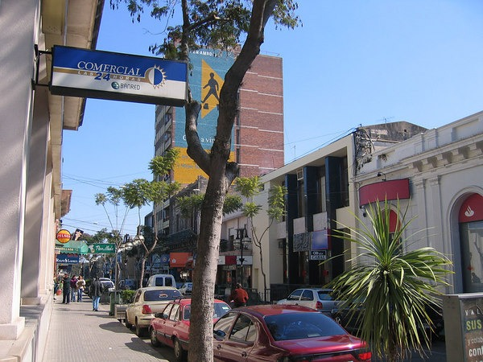
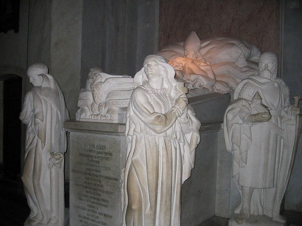
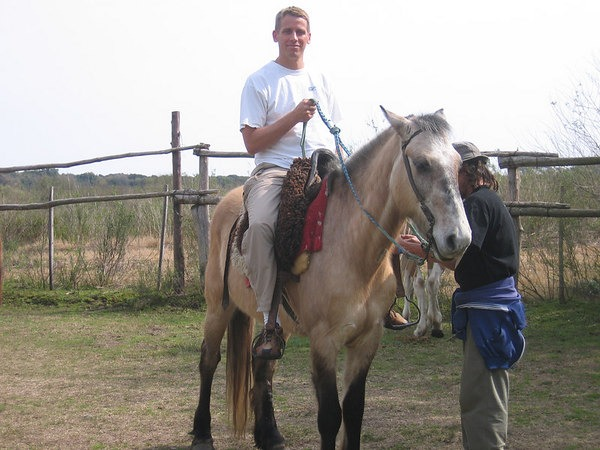
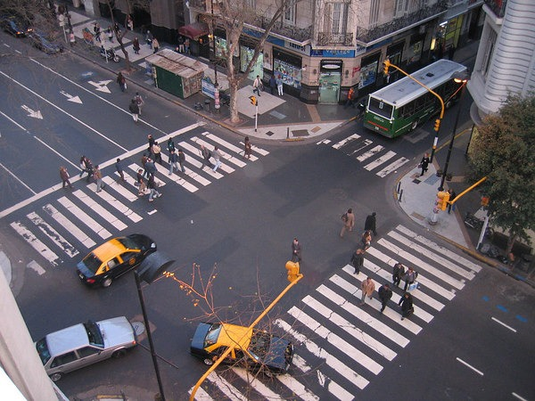

My 3 week trip in South America was hosted by Gap Adventures. The name of the tour was In Search Of Iguassu - Rio to Buenos Aires. I'm glad I took the trip and got to visit a nice section of the world. Brazil underwhelmed me, Uruguay exceeded my expectations, and Buenos Aires, Argentina came close to being the perfect large city. We also made a surprise visit to a part of Paraguay that makes Tijuana look classy.  The best part of the trip was the challenge of communicating with people in two unfamiliar languages (Portuguese and Spanish). My Spanish skills from the 8th and 9th grades are weak but were often enough to get by. Portuguese was much tougher and I only seemed to grasp enough to get by on our last day in Brazil. Note that as soon as I left Brazil, I promptly forgot any and all Portuguese words I had just learned. Our group was mostly 20-year-olds from the U.K. Everyone in our group was great and we all got along wonderfully. Nick and I found them much more mature than 20-year-olds from America. My biggest lesson was to be less concerned with the weather and pay more attention to food. It really baffles me how Brazilians can be so fit when they are surrounded by so many dessert options. The picture above is me on Ipanema Beach in Rio De Janeiro, Brazil. Below are links to the day-by-day breakdowns.

### Day 1-2 - Rio De Janeiro, Brazil

Having ridden in a Tijuana cab, I was prepared for our taxi ride from the airport to the hotel. Lanes on a Latin American highway are merely suggestions. The shoulder of the road is a _bonus lane_. And I don’t believe that there exists a Spanish or Portuguese word for _tailgating_. After arriving at our hotel, we took a walk of the Copacabana region and Ipanema Beach. I expected Ipanema would be Miami Beach nice. It wasn’t. Ipanema looked like it was frozen in time from the early 1980s.  There are great restaurants in Rio De Janeiro, but you may not stumble into them by accident. If you are a vegetarian, diabetic, or on a carb-restrictive diet, take the time to research your food choices before coming to Brazil. If however you have a sweet tooth and believe dessert is the most important meal of the day, you will have no trouble running into tasty treats on every street corner. Before meeting up with the group tour, we took a City Tour that took us to the Rio De Janeiro highlights of Sugarloaf Mountain and Christ the Redeemer of the Open Arms. We also got to drive by the ghetto. If you saw the movie City Of God, you’ll understand why we didn’t get off the tour bus and walk around. 

### Day 3-6 - Ilha Grande, Brazil

The morning after meeting up with the tour, we immediately left for the island portion of the trip. Ilha Grande, Brazil was a laid back small beach town. The dogs didn’t have collars or chains, they ran free and the town took care of them collectively. It was the favorite portion of the trip for our tour leader. While on the island we swam in the ocean, hiked, snorkeled, and visited an old prison. The island hosts Lopes Mendes Beach, which has the nicest sand and clearest water I’ve ever seen. Ilha Grande was the highlight of the Brazilian part of our tour. 

### Day 7 - Parati, Brazil

Parati (aka Paraty), Brazil was a little town between Ilha Grande and the Sao Paulo bus station. Brick streets and some of the best food I had on the Brazil portion of my trip. Day 8 was a travel day. 

### Day 9-10 - Iguassu Falls, Brazil/Argentina

After having to switch buses at 3 AM due to a breakdown, we made it to the Brazil side of the Iguassu Falls. The falls were running at their low point for the season. During high season we were told the water volume is ten times greater. On the Brazil side, we took a helicopter ride over the falls. The Argentina side was much nicer. On that side, we took a boat ride as well as walked a catwalk up to the edge of the Iguassu Falls. That night we attended a show that I can best describe as a Latin American Luau, only it was actually pretty good. My photos for that show did not turn out very well. 

### Day 11 - Paraguay

We did a morning trip to a border town just inside Paraguay for shopping in Ciudad Del Este. Once we crossed the border our tour guide informed me and the other 2 Americans that we were in violation of international law. We had entered Paraguay without a VISA. He laughed it off, so apparently, it isn’t that serious of an offense. This town had the most aggressive salespeople I’d ever seen. In your face without pause. They made the vendors of Tijuana, Mexico look as apathetic as Circuit City employees. 

### Day 11 - Parque das Aves, Brazil

Nick and I went to Parque das Aves, which was an extensive bird park close to the Iguassu Falls. 

### Day 12 - Salto, Uruguay

Salto was a cute little town on our way to Montevideo, Uruguay. This day was called our _relax_ day. This meant a trip to Termas Del Dayman (spa) for a massage, sauna, and a hot water pool. I was just getting over 2 days of stomach pains, thanks to the poor food choices I made in Brazil. The food in Uruguay and Argentina suited me much better than in Brazil. 

### Day 13-14 - Montevideo, Uruguay

Montevideo was a nice mid-sized city that at first glance seemed vibrant. After a day I noticed that nobody in this town smiled. They wear dark clothes and walk around in a state of sadness. I confirmed this with our tour guide. He told me this is the only city in South America that he’s been to where the people seemed this depressed. There was one happy person. The kid working at the Mcdonald's was the best employee I’d ever seen at that fast food chain. Why was I eating breakfast at Mcdonald's? Because the people in South America tend to sleep in a little later. Mcdonald's was the only breakfast place open before 9 AM. This is a city of 1.5 million people. While in Montevideo we did a City Tour, visited a mall, did a long walk, and in the evening listened to some kids perform tango music at a restaurant. 

### Day 15-16 - Colonia, Uruguay

Colonia was a small town where the food was actually excellent. Here we went horseback riding. 

### Day 17-20 - Buenos Aires, Argentina

We arrived in Buenos Aires, Argentina at night. What a beautiful city. As someone who has never been to Europe, the American city it reminded me most of was D.C. with the nightlife of Boston or New York. Buenos Aires is a cheap city. Even though it has a higher standard of living than Brazil and Uruguay, the US dollar goes far. Food and clothes are very cheap. And the food was outstanding. While in Buenos Aires we did a City Tour, saw an outstanding Tango show, visited the Buenos Aires Zoo, and did lots of walking/shopping.  

---

## Comments

### Rob
*May 28 at 2008 at 8:21 PM*

Hey there!  I'm taking this trip next month with my girlfriend.  Just wondering how the transfers, bus rides where?  Where they dangerous, comfortable?  Any recommendations?  Backpack vs. luggae with wheels?

---

### MAS
*May 28 at 2008 at 8:54 PM*

Backpack for  sure.  

Our group leader took care of all the bus tickets.  The roads in South America are very bumpy.  I was able to read on those hours spent on the road, but many were not able to.

---

