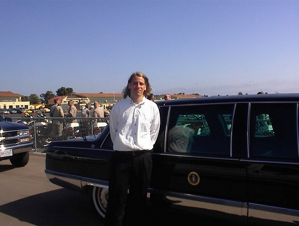
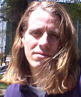

_On June 22-23, 2000, I got to drive in a Presidential Motorcade. This is the original story written on June 24, 2000._ The phone rang in our apartment one Sunday afternoon. My girlfriend answered. I heard her answer questions in a very deliberate manner for a few minutes before handing the phone over to me. "It's the White House, they want to ask you some questions." President Clinton was to arrive in San Diego for some Democratic fund raising in a few days and the White House needed a few volunteers to help drive vehicles in the Presidential motorcade. As a former all star delivery driver for Pizza Hut, I was sure the White House was aware of my legendary driving ability. Actually, we got the gig through our friend Dominique who used to work in the White House and (at the time) worked for the Department of Transportation. Anyway, the White House wanted us to drive vans in the motorcade.  We needed to attend a meeting with other drivers a day before the President arrived. This is where we got a brief overview on how to be a good motorcade driver and where to show up the next day. The other drivers were VERY big Clinton fans. It seems that I was the only driver that wasn't a volunteer for either the White House or the Democratic Party at some point or another. On Thursday afternoon we arrived to pick up our vans. I was assigned Wires 1 and she was assigned Wires 2. Wires 1 held press from AP and other news sources. Wires 2 had Time magazine reporters and photographers. Once we got our vehicles, we drove out to the Naval Air Station North Island on Coronado, where the President was to land. At Coronado our vans were searched for bombs by Secret Service agents and special trained dogs. Before the landing we were instructed on how to drive in a motorcade.  Once the President arrived and the vans were loaded up with the press corps, the motorcade was off. The California Highway Patrol cleared and secured all the roads and bridges along the route. As we drove to the first stop, motorcycle CHIPS sped passed us on both sides to keep the motorcade moving securely. The first stop was the El Cortez, a downtown landmark in San Diego that is being restored. **This is where I made a BIG MISTAKE.** I turned my engine off and left my headlights on while the President was inside the El Cortez giving a speech. I was too busy laughing to a Phil Hendrie skit on the radio and I forgot to turn off my headlights. Then just as the press was running out of the building back to the motorcade, my car battery dies. Oops! The motorcade stops for no one. Can you imagine Clinton and the Secret Service agents asking for jumper cables? I didn't think so. They rushed me into another van and the press people who I was driving were ushered into several other vans. Wires 1 was abandoned as we took off for the next stop. To save a little face, I blamed the van for having a weak battery. The next stop was a DNC (Democratic National Committee) fund raiser; the tickets were $25,000 a couple dinner. They brought food to us as we waited in the vans. I'd estimate my meal was worth about $5, which makes me wonder what another $24,995 would have bought me. This is where all the drivers got to do the "grin and grab" with the President. Whenever the President uses a volunteer motorcade, there is usually 1 minute set aside for him to thank the drivers and pose for pictures. While waiting for the event to end, my van was jump started and returned to the motorcade. I told the CHIPS to I'd keep an eye out for any battery trouble. At the end of the fund raiser, President Clinton exited the elevator and, one-by-one, greeted each driver as the official photographer clicked away. He said "Thank you" to each of the drivers, until he got to me. **Clinton looked at me and said "Thank you man".** _Why did the President add the word "man" when he got to me?_ There was no time to stand around, each of the drivers had to run back to the vans to drive Clinton to the residence for the night. That night, the President stayed at a quaint $55 million dollar home of a very big donor for the Democratic party, located 30 miles north in an area called Rancho Santa Fe. It was fun driving north on 5 with the entire freeway blocked off for you and the rest of the motorcade. Presidential motorcades also don't stop for anything. Driving the motorcade at night, we were instructed to keep in close to minimize security risks.  The next morning we returned to pick up the President and drive the press corps to a small airport in Poway where a helicopter took President Clinton to Chula Vista to see the Olympic training center. We served our country, met the President, and added an interesting story to our repertoire. Going home, the words "Thank you man" rang in my mind. Then it struck me that my own President thinks I'm a HIPPIE. Politicians are the best judge of character, and Clinton had me all wrong. I like Sinatra not the Grateful Dead. At that point, I decided it was time I needed a haircut, so I got one a few weeks later. This makes Clinton the most influential President of my lifetime. **President Clinton personally inspired me to cut my long hair.** How many other people can say that?  

---

## Comments

### Steve
*October 29 at 2009 at 2:35 PM*

Thanks.  I just had a very similar experience with President Obama.  Except I kept the engine running when the lights and flashers were on.

---

### MAS
*October 29 at 2009 at 3:20 PM*

Ha!  They probably mention me in the training now.

---

### Tom
*July 16 at 2010 at 4:13 PM*

Michael.  Just drove for Obama yesterday 07/15/10 in Holland Michigan.  I was assigned to the press. Pretty much same experience as you without running down my battery.  I also left my lights on but the white house guy yelled at us all to turn them off.  It was then a sprint to meet the president and get our picture taken and then another sprint back to the vans.  I wasn't going to introduce myself because I figured the president meets about 100 grey haired 60 year olds everyday, but after greeting him Obama says "Hey, what's your name?"  I can't tell my wife (because you know marriage, child birth, etc.) but it was the greatest experience I've ever had?

---

### MAS
*July 17 at 2010 at 4:51 AM*

@Tom - great story.  Thank you for sharing!

---

### leonard
*November 11 at 2010 at 3:23 PM*

It has always been a long standing fantasy to meet any president of the united states (especially Mr. Obama). I have always had an keen interest of men or women of power and I would someday like to meet the president of the united states. Something about the power and the protection of one individual that thrills me. So I envy those who are fortunate enough to meet the man himself. Also I would like to meet and talk to a billionaire someday. I would just love to know how he or she thinks and if they are humble or nice or friendly or what. I bet the amount of knowledge they've amassed is incredible. I know it sounds funny but I plan on being one myself someday.

---

### MAS
*November 11 at 2010 at 3:29 PM*

@Leonard - This year I got to briefly chat with a <a href="https://ineedcoffee.com/starbucks-coffee-college/" rel="nofollow">billionaire</a>.

---

### Michelle
*November 11 at 2011 at 2:45 AM*

That was pretty cool, but I do prefer the shorter look

---

### MAS
*November 11 at 2011 at 2:46 AM*

@Michelle - How about this short?

https://criticalmas.org/2007/02/the-marine-haircut/

---

### Heath
*December 26 at 2011 at 6:38 AM*

Thanks for posting such a wonderful account of your motorcade experience! I too had the opportunity to drive in one of President Clintons motorcades back in September of 1997. Clinton was attending the UN General Assembly meeting in NYC. At that time, I was only 17 years old...and was stunned that they allowed me to participate in the motorcade at such a young age. I drove a press van myself. It was such an awesome, once in a lifetime event that I will never forget! People think I made this story up...but alas, I haven't and your story here proves that others were as lucky as I was to have been a part of a Presidential motorcade. I too had my 5 seconds with President Clinton and have the picture snapped by the official white house photographer hung p on my wall...my prized possession. Again, thanks for sharing your story!

---

