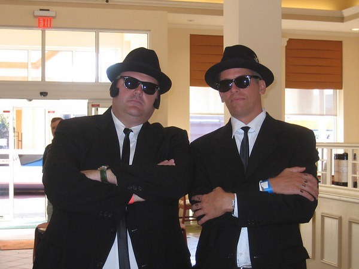
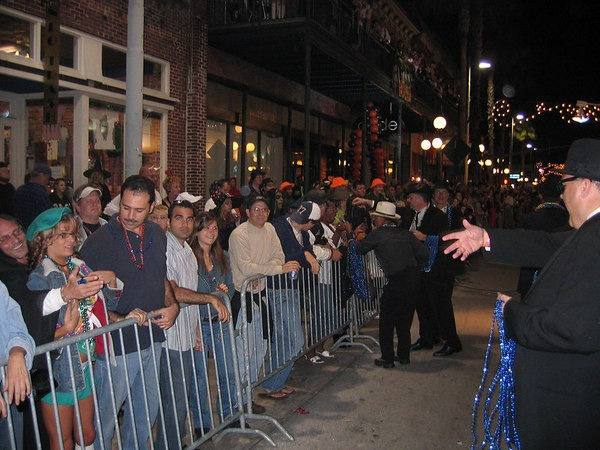

I'm back from my 12th Guavaween. Another year, another great time. The first thing I learned once I arrived in Ybor City was that the Tampa Bay Brewing Company relocated. They left 15th St and reopened in Centro Ybor next to the 20-screen Muvico. They lost their upstairs, balcony and dart boards. They gained a much larger kitchen, more dining room and an outdoor beer garden.  Repeating as the Blues Brothers this year was a tough thing for me to do. Every year I try and come up with a new costume idea. From 1997 till this past weekend, I never repeated a costume. However, repeating this year as the Blues Brothers turned out to be a very fortunate decision.  A hour before the parade started we were walking near the floats in the staging area. It was there we met a fellow dressed exactly like us. We learned that he was part of the Krewe of Blues and they had a float in the parade. He took us down to met his Krewe, where we saw about 10 other guys dressed up like us. Like the Blues Brothers. We all became friends quickly and idea of letting us join them on the parade route surfaced. In 2004 we tried to join the Castle float but were shut out. For those that have never lived in Tampa, let me explain that being part of a Krewe is a HUGE deal. Many of the Krewes have histories that go back over 100 years with closed membership. Being asked to join a Krewe is a big honor. Last Saturday, Nick and I were invited to join the Krewe of Blues in the parade. We walked along a float that had it's own live band. We got to throw beads out to 100,000 or so people that attended Guavaween. Could have been the single best Guavaween moment I've ever experienced. Good times!  If you missed Guavaween, shame on you. Hope you had fun running errands for your wife/girlfriend this weekend. 

---

## Comments

### Jessica
*October 13 at 2013 at 3:34 PM*

WHERE are the RAT lady pics?!!!  hahaha...I still always think of you and your girlfriend back then as the rat ladies at guavaween! hahahahah

---

### MAS
*October 13 at 2013 at 3:51 PM*

@Jessica - Sadly, all the photos from Guavaween 1997 are missing. Same with 1998.

---

