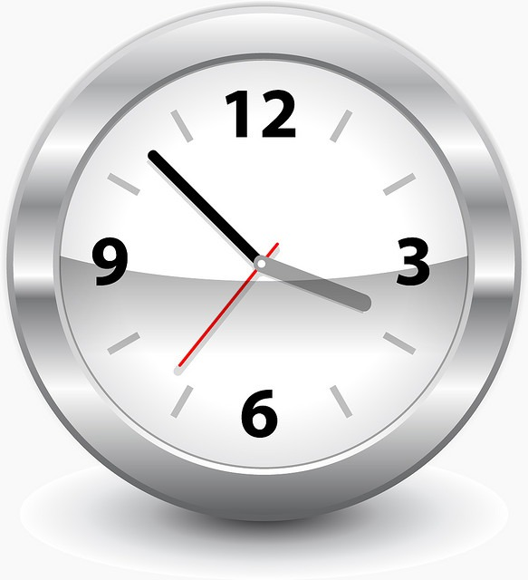

It needs to be said that people on the West Coast are awful when it comes to being on time. Meetings never start on time. Vendors never show up when they are supposed to and people also underestimate how long it takes to get somewhere. I don't know what it is about Pacific Time that makes people late. Having spent my first 30 years in the Eastern Time Zone, I will say they are far more punctual. Generally, I've found:

-   **West Coast** - People show up 5-15 minutes late on average.
-   **East Coast** - People show up 5-15 minutes early on average.

 _Photo by Heiko Klingele_ **Legacy Comments** JeSais

> I hate that late thing... guess its from growing up in a military family!! we were always 15 minutes early.