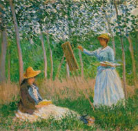
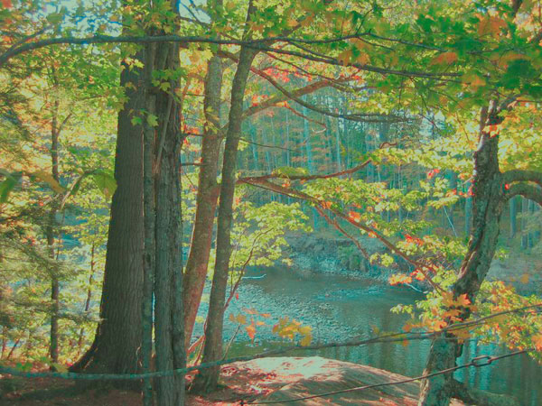
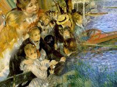
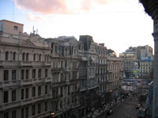
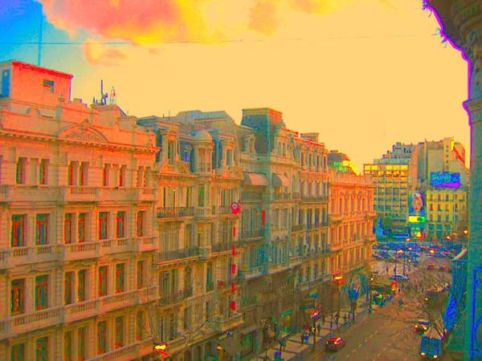

Today I was having some fun in Photoshop. Take the colors from a classical painting and apply them to a photograph. Below is an autumn photograph from New England, a Monet painting and the resulting mashup.     Using Photoshop CS it is a very easy process. Load the painting and your photograph. Put your photo in focus and then select _Image … Adjustments … Match Color_ from the toolbar. From the _Source_ dropdown, select the painting and click OK. That’s it. You’re finished.

### Montevideo, Uruguay Meets Renoir

The first photo is a building I photographed in Montevideo last summer. The second is a classic Renoir painting. And the third is the Photoshop mashup of the two.     

### Buenos Aires Meets Matisse

After leaving Uruguay, I went to Argentina and took the first photo. The second image is a Matisse painting. And the third is their hybrid.    

---

## Comments

### Shirley
*April 28 at 2010 at 7:59 PM*

May we use your Monet mashup autumn image in our alumni newsletter? We will give you credit and provide a live link to your website in our online version.

Thank you

---

### MAS
*April 28 at 2010 at 8:37 PM*

Yes.  Go ahead.  Send me a link when it is live.  Thanks.

---

