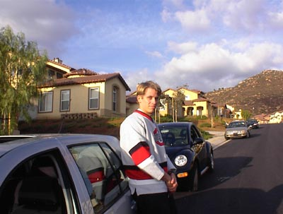

Just before I left the Peoples Republic of California, I received a notice to renew my license plate tags. Since I was heading to the Evergreen State, I placed that paperwork in the circular file. Upon arriving to the Seattle Metro area, I promptly got my Washington drivers license, plates and updated my auto insurance.

I followed the rules. Or did I?

Nope. California sent me a nasty letter called a _Notice of Intent To Suspend_. It was a lot of threatening verbiage about them sending Commando units to my front door to collect their license fee. Or something like that. I didn't read it.

This is what I learned about the California DMV. Not only are you required to check in when you arrive, but you are also required to check out when you leave.