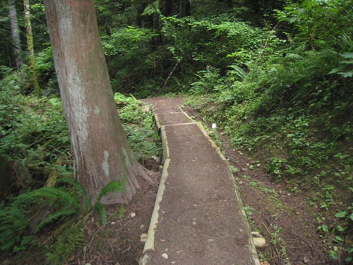
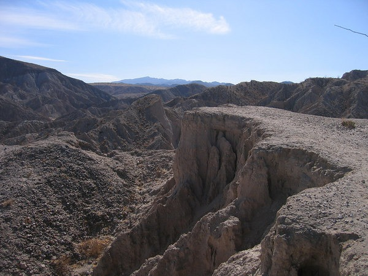

As much as the people of Seattle rave about the hiking here, it doesn't even come close to the diversity of trails in the San Diego region. Outside Seattle all the hikes look pretty much the same. Every trail seems to have the same thick green forest with not much in the way of views. Each route up looks very similar to every other mountain. The only thing that is different is perhaps a different view from the summit.

San Diego is far superior. Coastal hikes, canyons, mountains, snow and deserts. Unlike the hikes in the Seattle region, San Diego hikes have spectacular views. Now don't get me wrong. I still enjoy the heart-racing steep hiking of East Seattle. However, now that I live in the Seattle region, I will be leaving my camera at home when I go hiking.

**Legacy Comments**

Anonymous

> Dude..... keep on posting. I'm contemplating a move from San Diego to Seattle myself and your posts here are comforting. You're really helping me with kinda plotting out things for myself.

Aviva

> Have you taken a ferry out to Port Townsend yet? or been to Canada? Or Hoh Rainforest? So many amazing things to see within a day trip or weekend trip, it's not really fair to lump "outside Seattle" into the hiking category. The topography is much different, and there are a couple of mountain ranges to choose from. Anyway, just a thought. Are you otherwise enjoying Seattle so far?

Anonymous

> I agree with the comments aviva5271 left: branch out a little. Go to the coast and hike 3rd Beach to Oil City in the Park. Go over to the East side of the mountains and hike where you can easily see 360 degrees (Leavenworth/Chelan/Okanogan). Anyway, have fun!

MAS

> I don't consider Port Townsend, Mt. Olympic or Canada to be Seattle. I do consider East Seattle hikes along the I-90 to be part of Seattle, since they make up 99% of the hikes in this metro.
> 
> The Seattle metro may destroy San Diego in many areas. Hiking is not one of them.