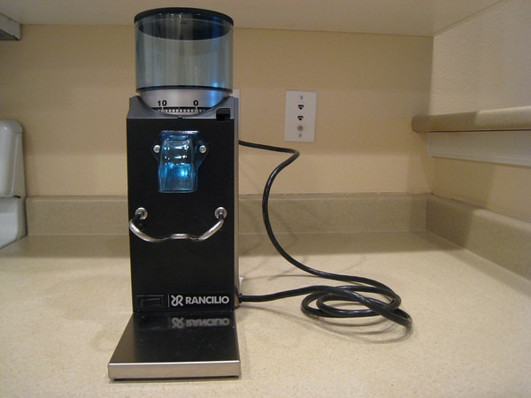

Meet the newest member of the family, Rocky. He came into this world Saturday evening at a weight of 23 pounds. And he has already started chewing. The little guy is able to grind coffee perfectly for espresso shots.

Here is Rocky standing next to his big sister [Silvia](https://ineedcoffee.com/rancilio-silvia-espresso-machine-tips/).

Their older brother [Barista](https://ineedcoffee.com/hacking-the-starbucks-barista-grinder/) and I had a falling out. I don't expect to be hearing from him anytime soon.

**Legacy Comments**

Derek

> Oh man, I'm really jealous. I keep telling myself someday that I'm gonna treat myself to this holy-duo of home espresso. But that day has not yet come for me. Congrats!

MAS

> The quality of my espresso doubled this weekend. Can you really put a price tag on that? :)