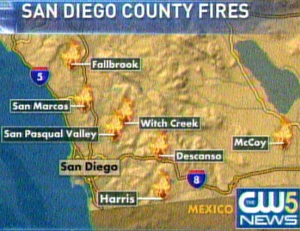
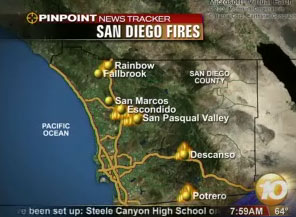

History is repeating itself. Fires have broken out in North, East, and South county. Below is a map of the fires put on the news this morning.

Just like 2003, our old neighborhood in East Escondido is being threatened by the San Pasqual Valley Fire. Our friend and Rainman are near the Harris Fire.

Here is what I wrote on my blog on October 27, 2003.

> San Diego Fires - Because of the fires in San Diego, my house has been evacuated. I'm staying with friends on Coronado (near downtown). Our cats and some belongings were removed from the house prior to the evacuation.

Even though I'm in the Seattle area now, I'm following this news story. Just like the last time, 760 AM is doing the best job reporting this story.

More Photos From 8 AM: 

A 9 AM email from my neighbor who lived across the street from me when I lived in Escondido:

> We were evacuated at 2 am - everything is burning - we do not know if our house is standing but they are fighting the fire at the corner of 78 and Coverdale. The entire city is on fire! The 15 is closed - the winds are blowing 65 mph.

**Legacy Comments**

Chris

> We are in Scripps Ranch and got out at 8 am. I did not need someone to tell me to evacuate. At 2 pm, the evacuation was mandatory.
> 
> This is a good site, but of course, the traffic is currently making it very slow.
> 
> http://geomac.usgs.gov/

Shawn

> Hi MAS, So as you know I live in Rancho Bernardo. Specifically, I live in the La Terraza apartments, one of the first complexes to catch fire (you can see it on fire if you go to http://www.nbc739.com and then click on the "Firefighters contain fire at the apt complex".). We got awoken yesterday morning around 5:00 am by car horns blaring. I grabbed a few things and my son and got the hell out of there. We're fine, but it'd be nice to get some information. Last I heard the winds were shifting back to RB so god knows when we'll be able to go back. Governor has been cool, on the TV a lot, and has gone down to Qualcomm stadium. Still would be nice if they would add capacity to the main city of san diego web site, or at the very least restrict access to it for actual residents.

MAS

> Sorry to hear you were affected.
> 
> In every disaster, we learn something. Lesson 1 this time is local governments can NOT host web farms. Leave mega traffic sites to the Googles, Yahoos, EBays, M$ and Amazon.

Joan

> Michael, thanks for the links to media coverage. Since evacuating, it's been hard to keep up with who has the best news. Now, back home, I'm still occasionally in the (literal) dark.
> 
> P.S. Elvis was evacuated along with precious items. Yep, still have that computer you gave me years ago.

MAS

> Wow I can't believe you still have that old computer. What is even more amazing it that it was considered a precious item worth evacuating.