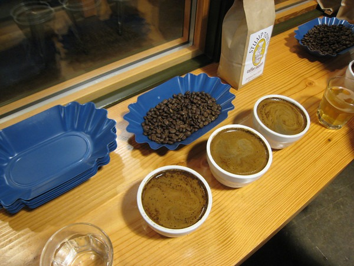
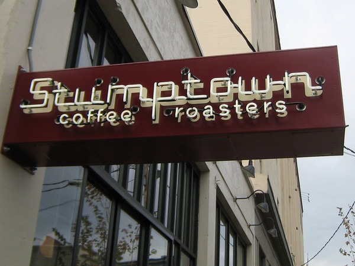

Woke up Sunday at 5:50 AM. Forgetting it was 4:50 AM due to the end of Daylight Savings, I proceeded directly to my espresso machine. Last week I started a 3 week _coffee cupping_ program at Victrola that takes place Sunday mornings. Since I had an extra hour to kill, I had my 2nd doppio at home. This week the topic was Blending. Part 1 was espresso blending. Part 2 was drip blending. Victrola uses 5 different beans in their espresso blend. To understand the taste of each component, we sampled straight espresso shots for each bean. Then we sampled the blend. They advised us to spit, but I didn't for two reasons. The first reason is the [Zoom reason](https://ineedcoffee.com/no-coffee-or-tea-for-at-least-2-weeks/). Since my dentist trip, I have developed a technique for sipping espresso that gets no coffee on the teeth. Tilt head back, round tongue, and pour. It needs to be a little cooler in temperature. Spitting the espresso would cause the teeth-staining espresso to pass by the teeth. For me spitting was not an option. The second reason is that I love espresso too much to spit. I know cuppers of wine and coffee are supposed to. But I can't do it. It just seems wrong. Part 2 was the drip blending. Our group of six each constructed blends and then proceeded to cup them. I left Victrola having cupped 6 drip blends and sampled 6 shots of espresso. It wasn't even noon yet. Now it was off to the Coffee Meetup group.  The [Seattle Coffee Meetup](https://www.meetup.com/seattle-coffee-club/) met for a cupping at Stumptown. I could have passed, but when I saw the bean selection I had to sample. One of the beans was the non-auction version of the Panama Esmeralda. If you recall, I called that bean the [Best Cup of Coffee Ever](/2007/09/best-cup-of-coffee-ever/). This version was outstanding as well. And at $22/pound roasted, it would be worth every penny. 