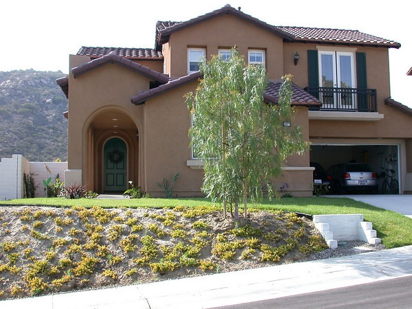

One of the criticisms I received for selling my house in 2006 and going into the rental market was that I wouldn't be _building equity_. Yes that is true. As a renter I wouldn't have the opportunity to _build equity_. However, my goal was not to _build equity_. It was to _preserve equity_. The Case-Shiller Index came out today and reported a 9.6% YOY decline in property values for San Diego. I sold in February 2006. The index uses September 2006 to September 2007 as it's range. Let's play math. For even numbers, my house was sold for $700,000. A 10% decline in housing values for this home is $70,000. Guess what? The money I _threw away_ in the rental market was a fraction of that number. Did I lose equity or preserve equity?  _I loved my house, but living there 1 more year was not worth a $70,000 loss in equity._  When will I buy again? When prices have bottomed. I expect that to take a few more years. How will I know when we are at a bottom? Mish had a great quote recently in the [All of a sudden, it just fell off a cliff](http://globaleconomicanalysis.blogspot.com/2007/11/all-of-sudden-it-just-fell-off-cliff.html) post.

> We cannot possibly bottom as long as people remain optimistic. A necessary but not sufficient ingredient of a lasting bottom is despair.

Besides despair, I would add that you need to see declining inventory levels. Meanwhile I'll keep saving my money. Every month I stay in the rental market equates to a nicer and more valuable home in the future. **Legacy Comments** JeSais

> wow. what a great way to look at it... now I'm not feeling so bad as a renter :-)