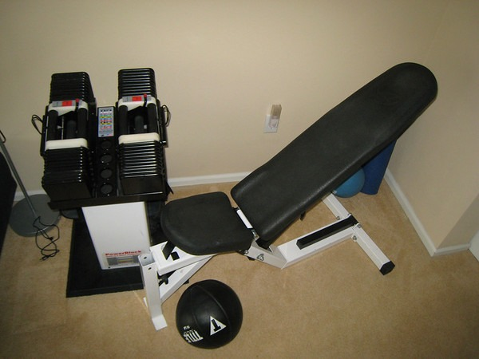

A little over a month ago I decided to leave the glitter gym and work out from home. On paper it seemed like a brilliant idea. My weights are in my office. I work from home. Why I could knock out reps all day long!

My plan failed.

I lifted weights a couple of times each week for maybe 7 minutes at the most. The weather started getting colder and just like my days in Ohio, I started to get sluggish. History was repeating itself.

When I had my home gym in Escondido, I was in the best shape of my life. What was different then? I think I've isolated three distinct variables needed for commitment to an exercise program.

### #1 Same Time of the Day

Lifting weights _whenever_ in my office, turned out to be _hardly ever_.

### #2 Separate Room

In my old house, the single car garage was dedicated to weight equipment. Nothing else occupied that room. The only reason to enter that room was to lift weights. Having weights next to your computer (and email inbox) is extremely distracting.

### #3 Pre-Workout Ritual

Whenever I was the most dedicated to my exercise plan, I always followed the same pre-workout ritual. Change into proper clothes. Pull double shot of espresso. Fill water bottle. Crank up the Marilyn Manson. The caffeine would hit my blood stream about the same time the machine gun drumming would be pouring out of the speakers. At that point, nothing could stop the workout. Days when I was dead tired, I'd go through this ritual and within minutes I'd be fired up and ready to go. Just like Pavlov's dog.

What's next? I still have my glitter gym membership until December 24th. Remember [that story](/2007/10/glitter-gym-hijinks/)? After that expires, I have my eye on an independent gym. I was actually surprised to learn there are still some non-glitter gyms left in this country.

How did the trial run go today? At 3 PM\* I changed into my workout gear, downed a double espresso, filled my water bottle and headed off to the gym listening to high energy dance music (I'll locate my Marilyn Manson CD tomorrow).

_\* I work East Coast hours by choice (6:30 AM - 3 PM)._