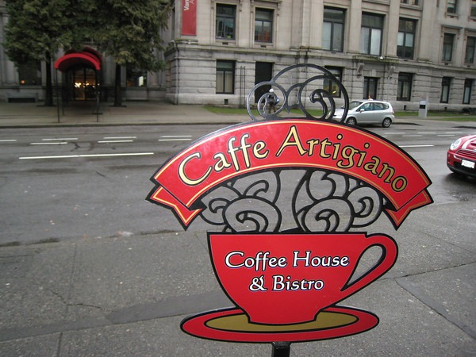
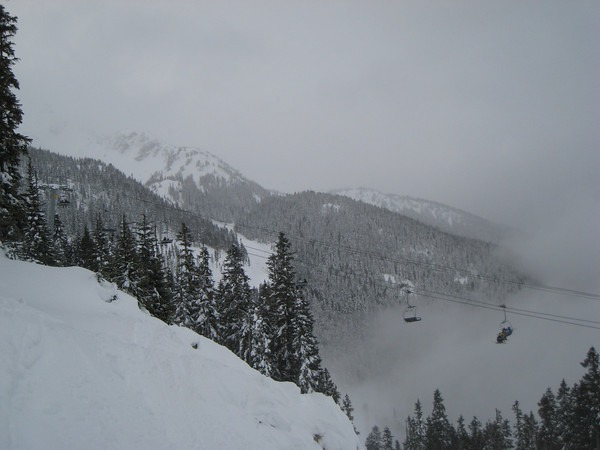
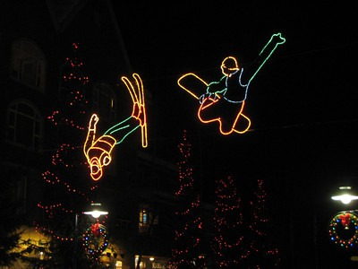

Vancouver was an amazing city. Think San Diego with frostbite. Actually it's downtown is further built out than San Diego. Despite the rain and cold temperatures, I was able to get some good photos. And I now have a new favorite coffee house: Caffe Artigiano. Great food, Clover and my new favorite drink the Americano Misto.

The second part of the trip was skiing in Whistler. It has been almost two years since my last ski trip. I'm still a beginner. I decided early on that I wouldn't be taking any refresher lessons. The best strategy would be to find a green (easy) slope and figure it out on the way down. This was a mistake. There are no bunny slopes in Whistler and the ones labeled green seemed much tougher than the other green runs I had down previously in Taos, Bogus Basin and Mammoth.

I have no business skiing. Unless you are willing to commit to skiing more than once every other year then you are inviting injury. That lesson sunk in about 50 meters (think metric!) down the mountain. Almost 90 minutes and several bruises later, I made it to the bottom of the mountain and added skiing to my list of sports than I've retired from.

Whistler was the kind of village you would see in Holiday X-MAS movie (starring Tim Allen). Although I plan to return to Vancouver in the summer, unless I come out of retirement and decide to take skiing seriously, I probably won't return to Whistler. If you are a skier, you will enjoy Whistler.