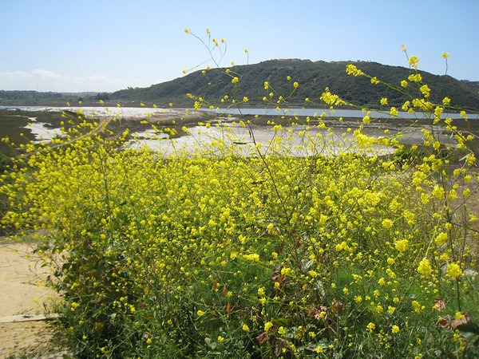

Seems there are two camps of people out there. Camp one are fans of Seattle and believe that this blog has been too harsh on the area. One person wrote me and stated with the exception of coffee, I wasn't singing the praises of Seattle enough. That's like saying with the exception of X-MAS, that Santa Claus guy is a lazy slob.  _Kubota Garden in Seattle_ Camp two is the San Diego crowd that keeps asking me to defend my decision to leave America's Finest City for the Emerald City. I get the impression they believe I'm not thinking straight.  _Batiquitos Lagoon in Carlsbad (North County San Diego)_ And the last odd thing is that the Camp one people have never been to San Diego and the Camp two people haven't been to Seattle. This puts me in an odd position of having to tell Camp one that Seattle is not all rainbows and unicorns and telling Camp two that Seattle isn't East Berlin. After reading books on predictive failures such as The Black Swan: The Impact of the Highly Improbable and Stumbling on Happiness, I know better than to say something subjective like _The people are nicer ...._. I've isolated four variables that I'm knowledgeable about. These four variables are important to me and not necessarily you. But that is OK since I'm not asking you to defend or critique Seattle. **1:Weather** - San Diego wins. I like the sunshine a lot. This is important to me and can not be discounted. But this is a known variable. Prior to moving here, I reviewed the data on [WeatherBase](https://weatherbase.com/) and knew what I was in for. **2:Cost of Living** - Seattle wins. After spending over a year on my Summer of George traveling and spending money, I wanted to live in an area where I could save back my spent savings at a faster rate. Washington has no state income tax. And both my rent and auto insurance cost less. Before I left I read that Seattle is [32% cheaper](/2007/04/seattle-vs-san-diego/) than San Diego. That sounds about right. **3:Coffee** - Seattle wins. The legends are true. Coffee is very important to me. I've met many coffee professionals and fans here in Seattle. My home roasting and espresso blending are reaching higher and higher quality since arriving. **4:Hiking** - San Diego wins. I got some slack for that statement, but it's true. Seattle has better hiking than the vast majority of the country, however, that doesn't include San Diego. If you have to leave Seattle in order to get to good hiking, then you aren't in Seattle anymore. San Diego doesn't need Mexico or Riverside/Orange Counties in order to have great hiking. San Diego has a greater diversity of landscapes than Seattle. There is no perfect place. Perhaps one day I'll spend half the year in Seattle and the other half in San Diego. I'm sure you can guess which half would be spent where. **Legacy Comments** Kelli

> While I've visited San Diego a number of times, I admit that I've never lived there. Weather: Sure, San Diego wins. But you haven't yet enjoyed a full summer here, so consider a re-evaluating after next year. Transportation: Seattle wins. Every time I visit San Diego, I get off the plane and out in the sun...and wonder why I don't move immediately. Then I get in my car and sit in a freaking grip of traffic and remember the high price to be paid for paradise. just my two cents...from a member of Camp One.

Joe

> I find myself without a camp entirely. :- Fun argument though! Well, sort of.

MAS

> I may not have been clear about the Camps. The Camps are not which city you like better, but the groups that think I need to be nicer (or more critical) of Seattle on this blog.

Joe

> Ah, I think I see. I think both cities are perfectly fine, but I've not lived in Seattle. But I think you've not been there long enough to give the "absolute and final fair and balanced" Seattle report. I think you have a realistic view so far and I've been enjoying your assessment of the place.

KirkH

> Rain + Mindblowing Coffee vs. Sun + Raging Wildfires. Tough call.

MAS

> ROFL. Well Said.