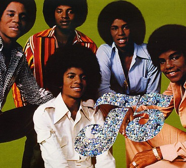

If I were a comic book superhero I would have the oddest _super_ power. My presence in public places will often change the music being played to 1970s pop. Doesn't matter where I am. Doesn't matter what was playing before I got there.

Many people have seen this effect. When TheTailGunner and myself were taking a cab ride in Rio De Janeiro, Brazil the cab driver flipped from Portuguese station to Portuguese station until he landed on an English radio station playing 1970s pop music. And with no words exchanged between us, he stopped changing stations. My powers were working.

Spiderman may be able to shoot webs. Superman may be able to fly, but I have the power to look at a radio and silence the wails of Dave Matthews and John Mayer with the sweet sounds of [Polyester and Cheese](/2007/04/polyester-and-cheese/).

There is one exception. My Kryptonite is [Glitter Gyms](/2007/08/tales-from-the-glitter-gym-locker-room-edition/). Somehow my powers are ineffective there.