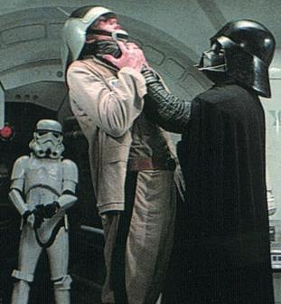

My prison sentence with the Glitter Gym has finally ended. The last month was unbearable. Expect to see a final _Tales From the Glitter Gym_ installment soon.

Yesterday I found a _Rust_ gym. I didn't even think they existed anymore. Now when I use the term _rust_, what I really mean is it is a serious gym. You'll hear rock music. Guys who can bench press their weight are the rule, not the exception. You will not see the iPod zombies. The first time you don't rack your weights, you will be warned. The second time you'll get the Lord Vader treatment.

 _Rack your weights!_

The gym is Iron Works on the Redmond side of Bellevue, Washington. This is the coolest gym I've ever been to. When I walked in I noticed the classic Frank Zane pose painted onto the wall. The owner greeted me and we quickly realized we both knew the legendary [Harry Smith](https://web.archive.org/web/20140730163752/http://www.sptimes.com/2004/07/23/Citytimes/When_Harry_met_flabby.shtml) of South Florida. There is an autographed photo of Ronnie Coleman upfront. They even have 200-pound dumbbells. Yeah, buddy!

I'm home.