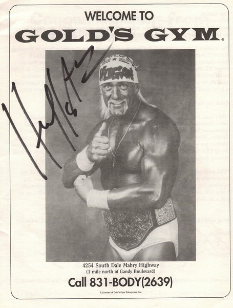

About two years after my [car chase with Hulk Hogan](/2008/01/that-time-i-got-in-a-car-chase-with-hulk-hogan/), Golds Gym opened a new location in South Tampa. As part of the grand opening they had Hulk Hogan and Macho Man Randy Savage show up to sign autographs. Of course I had to go. It was a zoo. Wrestling is huge in Florida. The Hulk is huge. As a member of the great unwashed mass of people in front of the gym that day, I was lined up and shuttled past two desks. One with the Hulk and one with Macho Man. There was no time to relive old stories of car chases, I was handed a my signed memento and hustled out the door. Below is a scan my non-personalized souvenir from that day.  