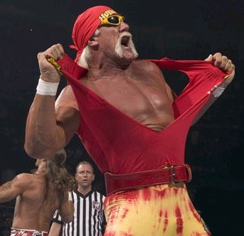

It must have been July or August of 1994. I had just moved to Tampa Bay from Columbus in June. For a few days I had two friends down from Ohio. Being the host the of a new town, I took them for a drive of the area. Ryan was in the front seat and his friend Mike was in the back seat. Ryan and I were talking as we drove away from Clearwater Beach towards downtown Clearwater. From the backseat, Mike interrupted.

> I think I saw Hulk Hogan. That car up there. The black Mercedes. I think it's Hulk Hogan.

Even though I had been in the Tampa Bay area for less than two months, I knew this area was home to many professional wrestlers. It was possible that [Hulk Hogan](https://en.wikipedia.org/wiki/Hulk_Hogan) was in that car. Growing up in Ohio means you never see celebrities, so this was a big deal for three of us. I had to find out if it was the Hulk.

> There is only one way to find out. Hang on!

For the next few blocks my Honda Civic hatchback jumped from lane to lane chasing down a black Mercedes. All the while Ryan and Mike cheered me on. I knew once we got past downtown the odds of me keeping up with the sports car would be slim. Then I got the break I was looking for. The light turned red. The black Mercedes was stopped in the left lane. I did an aggressive pass and got into the right lane and pulled up even with Mercedes. And at that moment all three of our heads turned in unison and we looked into the other car. The driver noticed and turned his head towards us. It was Hulk Hogan! Then in a classic move I'll never forget, he put his hand up and gave us a salute wave. The light changed and he tore off.  We cheered him as his car got drove away. And that is the story of the time I got in a car chase with Hulk Hogan.

---

## Comments

### Mike
*July 10 at 2009 at 2:34 PM*

I have a guess which road you were on and I can totally picture it happening there.  It's also the same road where his son was drag racing while drunk and got into a crash so bad that the other kid in the car was left with brain damage. Not as bad, but the media here follows his divorce like a hawk and really knocked him down from childhood hero, to D-list celeb in the middle of a crisis.

---

