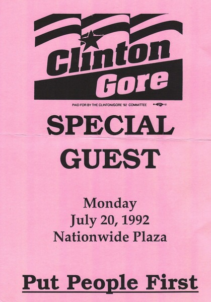

I've already told [the story](/2008/01/the-first-time-i-met-bill-clinton/) how I met President Clinton in 2000 while driving Presidential Motorcade. Well that was actually the second time I shook Clinton's hand. Way back in July 1992 while attending The Ohio State University, a friend of mine showed up at my apartment with _Special Guest_ passes to see then candidate Bill Clinton. Always up for a celebrity sighting, I was game.

Clinton and Gore spoke for a while and then _ran_ down and greeted all the people with the _Special Guest_ passes. Rapid fire handshaking down the line. Below is a scan of the pass that provided me access.

