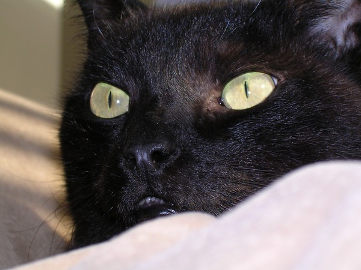

Just got word that our old pet cat RainMan died. I think he was either 15 or 16 years old. After a few days of being lethargic, he passed away last night. Rainman was the best pet I've ever had. He actually came when you called him and could even hand-shake. In January 2007, he went back to Jamul because he was an outdoor cat at heart. Then last fall, Rainman [survived the San Diego fires](/2007/10/rainman-survives-the-san-diego-fires/) living off the land until the mandatory evacuation was lifted.  Rainman was the cat I taught how to [hand-shake](http://youtu.be/4EYcqhXVSH4). [Photo Gallery For Rainman](https://www.flickr.com/photos/129592470@N02/sets/72157650059450816/) **Legacy Comments** Sheri

> So sorry :( I remember the posts and pics of RainMan when I first started reading your 'blog in '01. He was a cutie.

Joe

> Sounds like a great cat. Condolences.

Anonymous

> I'm sorry to hear that MAS. I had another friend that lost a cat this week as well. I hope you are doing o.k.