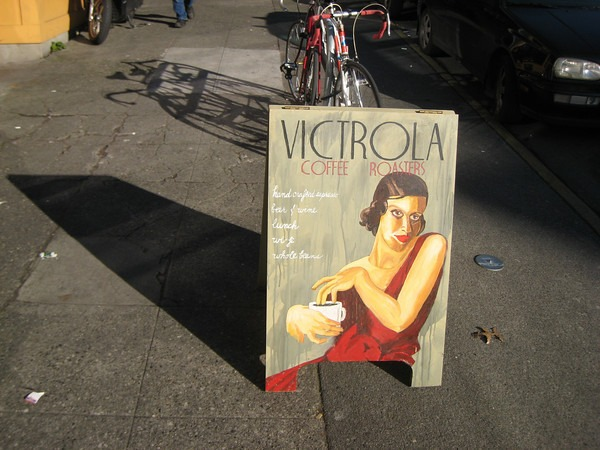

Today was Presidents Day, which meant that I was off work and the stock market was closed. The weather forecast for Seattle was 57 degrees and sunny. Perfect conditions for an urban hike. I've urban hiked Manhattan, San Francisco, [Auckland](/2006/09/new-zealand-trip-overview/), and [Buenos Aires](/2006/08/rio-to-buenos-aires-overview/). I decided to urban hike Seattle armed with my camera and GPS.

Starting south of Fremont at 8 AM I crossed the Fremont Bridge.

A morning visit to the Troll.

Coffee stop at Caffe Vita.

Then it was off to Wallingford.

More espresso at Zoka.

Then it was off to the University district and still more espresso at Trabant.

I hiked through the University of Washington.

From there I took the Montlake Bridge and made my way to Capitol Hill.

After a stop for tea, I made it to Stumptown for more espresso.

Before heading to Pike Market, I made one final espresso stop at Victrola.

At this point I returned to my starting point, which wasn't as easy as I thought. Going from downtown through Queen Anne on the way to Fremont has some big hills and lots of dead end roads.

A rough estimate of the hike was [14.55 miles](http://www.gmap-pedometer.com/?r=1636035). I'm tired and sunburned.

---

## Comments

### Jackie
*May 24 at 2010 at 4:05 PM*

Seattle is PERFECT!  A friend of mine and I have started doing urban walks. First one was a transect staying on 65th from Magnuson Park to Golden Gardens. Yesterday we went from Carkeek to Magnolia (just above the marina), hugging the shoreline as much as the tides would allow.  We came across places we've never been to, and this is even after living here close to 20 years!!!  Thanks for posting!

---

