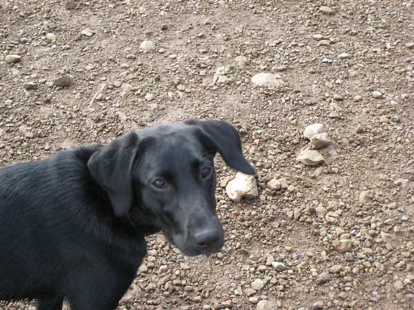

Now that I've acclimatized to Seattle, I decided to go for my first hike of the year on Sunday. Since all the hikes [look the same](/2007/10/hiking-in-seattle-vs-san-diego/) out here, I went for my nearest favorite: West Tiger (aka Exit 20).

I hit the trail at the same time as a lady and her 6 month old black lab. The dog would run 100 meters or so up the trail and then return to the lady. This process was repeated for the first few kilometers of the trail. I was hiking faster than the lady and soon I noticed the dog was using me as point of reference to run up and down the trail. I looked back for the lady and she was out of visual range. Not good.

I stopped hiking hoping the dog would stop his ascent up the mountain while giving the dog's owner time to catch up. The dog was too hyper and took off. I waited for the lady who was upset that her dog was not responding to her calls. Her concern was the dog would freak out once it got to the top and she wasn't there. The dog might go down the mountain on the other side.

The challenge was clear at this point. Get to the top of the mountain as fast as possible before this puppy freaks out. I was faster than the lady, who had a huge backpack, so I volunteered to help. I took off at a fast pace up this steep climb. Along the way I got status reports from climbers who saw the black dog. Each hiker stated the dog was just a few minutes up the mountain.

I think I arrived at the top of the mountain a minute behind the dog. The dog was begging food from everyone at the summit. She even grabbed a sandwich from one hiker. My task was to keep the dog occupied and not let it _freak out_ and head down the backside of the mountain while the owner who was five minutes from the summit arrived. My new task was obvious, I had to get this dog from eating the lunches of several hikers.

As the dog misbehaved, I called it and pulled it away from other hikers all while explaining that it wasn't my dog. Eventually the owner arrived and I was free to go.

An interesting first hike of the year.