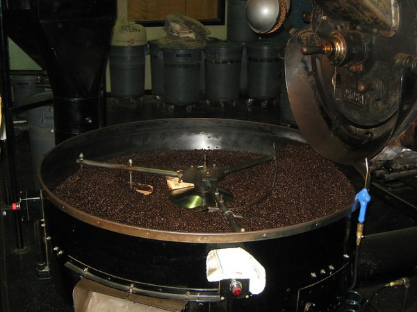

The [Seattle Coffee Meetup](https://www.meetup.com/seattle-coffee-club/events/7123582/) got a tour of Caffe Vita last night. They roast 2,000 to 4,000 pounds of coffee daily. Many coffee shops and restaurants use their coffee in the Seattle area. Unlike Victrola, they pre-blend their espresso prior to roasting.

