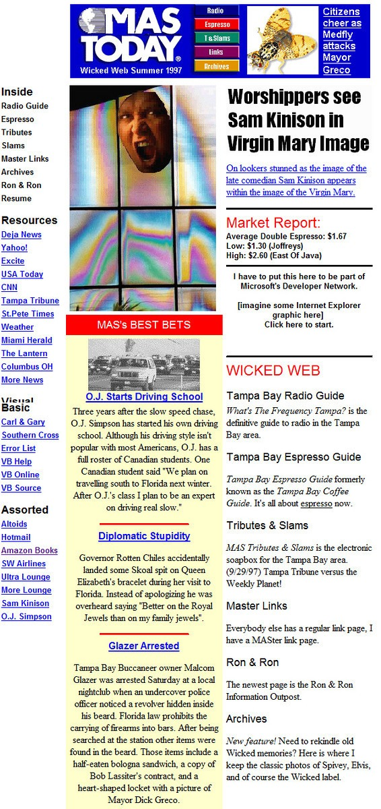
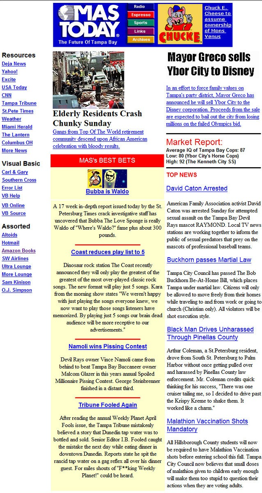

Before CriticalMAS existed I had a personal website hosted with a local ISP in the Tampa Bay area. The site had a very popular local radio guide called _What's the Frequency Tampa?_. It listed radio programming schedules much like television schedules are displayed. I built it by writing a program with Visual Basic 3.0 that generated HTML pages locally. Once the build was finished, the pages were uploaded. This was before Microsoft released Active Server Pages. Good times.

In addition to the radio portion of the site, there was a local coffee guide and some satire. The two pieces of satire that survived the last decade were local parodies of USA Today. The HTML was written for much smaller monitors and _old-timey_ browsers, so they look awful as is today. However, using screen captures and PhotoShop I was able to restore a close approximation of the originals.

The original **MAS Today** was released in July 1997 and was a local hit. The Tampa Tribune contacted me for a story on the top local websites. On 9/29/97 they did a front-page article in the BayLife section featuring a screenshot of my website, some quotes from me, and my photo. It didn't take much to get early web fame back in 1997. Those were simpler times.

Much of the humor below won't make sense to people who didn't live in the Tampa Bay area during that time period.

Success always invites a sequel. Just prior to leaving Florida, I created another MAS Today. It was a little darker and more cynical look at the Tampa Bay area. The second MAS Today was released in August 1998.

