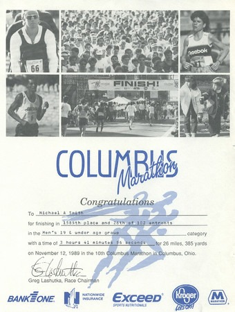
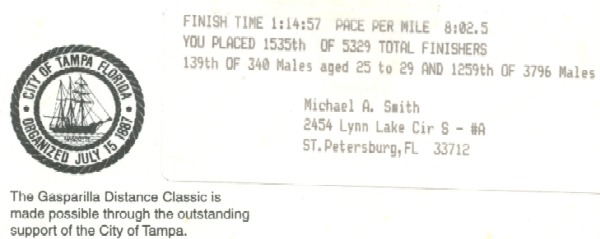

_Back in 2002, I assembled all the photos and stats from my running days._

During my first year of college (1988) I had knee surgery to correct a condition known as Osgood-Schlatter's Disease. I was forced to wear a full leg cast during my recovery. It was then I started to miss running. Later that year, I volunteered to work the finish line of the Columbus Marathon. Watching runners of all ages and abilities complete the race was my inspiration to run the marathon the next year.

Below is an overview of the most important races that I competed in from 1989 through 1995.

Date

Race

Where

Distance

Time

11/12/89

Columbus Marathon

Columbus, OH

26.2 miles

3:41:56

07/03/92

Independence Day 10K

Columbus, OH

6.2 miles

0:40:40

10/11/92

Columbus Marathon

Columbus, OH

26.2 miles

3:33:51

02/18/95

Gasparilla 15K

Tampa, FL

9.3 miles

1:14:57

03/25/95

Cha Cha Coconutman

St. Pete, FL

sprint triathlon

1:26:08

04/15/95

Clearwater 10K

Clearwater, FL

6.2 miles

43:30

04/30/95

St. Anthony Triathlon

St. Pete, FL

olympic triathlon

2:45:24

Sprint Triathlon: Swim 0.5 mile, Bike 15.5 miles, Run 3.1 miles Olympic Triathlon: Swim 0.9 mile, Bike 24.9 miles, Run 6.2 miles

### 1989

My first race ever was the 1989 Columbus Marathon. I'm sure most runners start off with a shorter race, but all I wanted to run was the marathon. My training for the race wasn't consistent or even intelligent. Prior to the race, the longest distance I had run was just 13 miles. Although I wasn't physically prepared for the race, I was mentally. Since the year before all, I could think about was completing this race.

Little did I know that I would do it in under 4 hours. In fact, I ran the race faster than my family expected. So after the race, I spent 90 minutes walking around downtown looking for them. 

After the race, winter came to Columbus. I stopped training and got out of shape. When the next year came I tried a few races, but I performed terribly. After I ran one marathon, I no longer wanted it as bad. My heart was no longer in it.

In 1991, although I still fancied myself a runner, I didn't compete in any races. By the time the spring of 1992 rolled around I was starting to sound like an old high-school football player recounting the glory days when I mentioned the 1989 marathon. It was then I started to think that my 1989 sub-4 hour marathon was a fluke and that I needed to prove myself one more time. 1992 was to be a make or break year for me.

### 1992

Unlike in 1989, I decided it would be wise to run a few races prior to the marathon. The one I remember the most was the Independence Day race. It was hilly and very hot. And I ran my fastest 10K ever and earned a 2nd place trophy for my age group. I was back!

The 1992 Columbus Marathon turned out to be my best race ever. Not only did I finish in under 4 hours again, but I beat my 1989 time by 8 minutes. My per mile pace was 8:10.

In 1993, I started getting hip pain whenever I ran. This pain continues to this day. In 1994, I decided to reduce the amount of running I did and pick up biking and swimming in order to transition to the triathlon. I moved to Tampa Bay and started triathlon training in June of that year.

### 1995

What I realized when I first started training for the triathlon was that I was a great swimmer and terrible biker. My running was decent but still painful. Unlike marathon running, I didn't go into triathlons with any time goals. I just wanted to have fun. My first race was the Cha Cha Coconutman Sprint Triathlon.

My 2nd race was the St. Anthony, an Olympic distance triathlon. Prior to that, I ran the Gasparilla, a 15K road race in Tampa.

Doing triathlons never really clicked with me. I enjoyed the two races I did, but I lost interest in the sport in 1995.

Today I no longer run or participate in triathlons. Chalk it up to been there, done that. During my triathlon training, I stumbled upon the book Optimum Sports Nutrition by Dr. Michael Colgan. In the book, the doctor explained how weight training can give endurance athletes a competitive edge. I used that wisdom and started lifting weights as a way to avoid the pain of running. Before long I ended up enjoying weight training far more than running. So in 1995 I unofficially retired from running.

---

## Comments

### Alyssa
*May 12 at 2015 at 1:09 PM*

Hi! This is an awesome story. My dad actually ran the 1989 Columbus Marathon for his first marathon also. He however forgot to pick up his finishers medal. If you or anyone you know that also ran the race would ever want to get rid of the medal I know he would be beyond grateful. (I know this is an odd question to ask). Congrats on the awesome running career!

---

