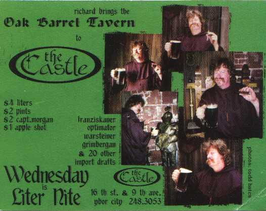
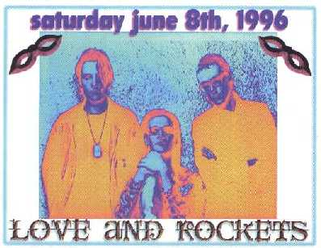
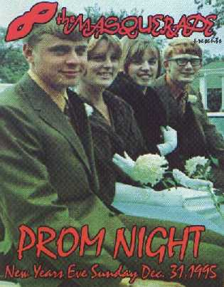
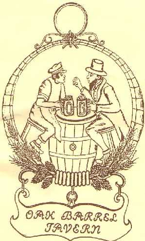
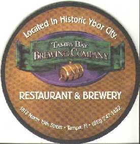
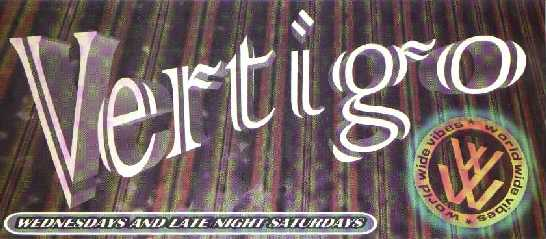

_This page was first assembled in 1999._ From March 1994 to August 1998, I lived in the Tampa Bay area. This is my collection of Ybor City overviews and memorabilia.

### The Castle

**The CASTLE** is a gothic/industrial club on the back side of Ybor. Leave your Gator sweatshirt at home and wear something black. If you like the music, you'll love the Castle as much I do. If you don't you'll be highly uncomfortable. When the _Oak Barrel Tavern_ closed, Richard came over and created Oak Barrel Wednesdays. Below is one of the coolest fliers ever made for an Ybor club.  

### The Edge

**The EDGE** was a spacious club that was sort of hidden. It resided behind Platforms by the railroad tracks. When it opened it was a refreshing change from the _Empire_. Great ventilation and music. Unlike the _Empire_, a non-smoker could actually breathe in this club. Another good thing about **THE EDGE** was they handed out free passes like candy. And unlike other clubs they kept the line moving a quick pace. The EDGE went under in 1998.  

### EMPIRE

**The EMPIRE** came into existence after the _Masquerade_ moved into the place formerly known as the _Ritz Theatre_. That vacant spot quickly became the Empire. In 1994, The Empire was a single floor. They wouldn't expand to the 2nd floor until 1997. Early on Empire played alternative and even gothic music, but overtime they regressed to a more hip-hop atmosphere. 

### MASQUERADE - THE FOAM PARTY

**The FOAM PARTY** is perhaps the greatest innovation in clubbing since the disco ball itself. Imagine being inside an enclosed dance floor as massive amounts of bubbles pour over you. The bubbles start piling up as the music plays. Before long the dance floor ranges from 2 feet of bubbles at the back to **6 feet of bubbles in the front**. Fellow patrons are running around with squirt guns and Super Soakers. Couples bury themselves in the foam for privacy. In short, this is one helluva a good time. To read about the **FOAM PARTY** is one thing. To experience it is something else. I tell people to imagine a sink filled full of foam with a tiny amount of water at the bottom. Blast some great music. Drink a few Mind Erasers. Now imagine a fork jumping around the sink. **You are the fork!** The Masquerade has to my recollection been doing the **FOAM PARTY** since 1996. One day a week during the spring and summer months, they setup the **FOAM PARTY**. Wrap everything in plastic. Keep your cell phones, Palm Pilots, pagers, and electronic car door openers at home. And if you must take something of value, use multiple layers of plastic wrap. You **WILL BE** soaked from head to toe!  

### MASQUERADE - LIVE MUSIC

**THE MASQUERADE** is a great venue for music. I'm guessing it holds about 1,800, which makes it great for artists on the way up or more likely the way the down. The two concerts I saw here were **LOVE AND ROCKETS** and **RATT**. Granted that isn't many shows for a four year period, but I'm not really a concert person anymore. 

### MASQUERADE - NEW YEARS EVE 12-31-95

**THE MASQUERADE** turned out to be a great place for New Years Eve 1995. No reservation or big cover. Just come on in and have a good time. And that I did. Below is a flier from the "Prom Night" theme New Years Eve party. 

### MASQUERADE - OTHER FLIERS

**THE MASQUERADE** had a great flier for a Friday the 13th theme. The other graphic is MASQUERADE MONEY. I've saved this money for almost 4 years now. Someday I'll get that free cover!  

#### OAK BARREL TAVERN

**THE OAK BARREL TAVERN** is the first chapter of my Ybor story. Before New World Brewing, Zion, and The Tampa Bay Brewery Company there was one place in Ybor where you could get a quality beer. That place was the Oak Barrel Tavern. OBT had about 30 imports and microbreweries on draft. After an evening at OBT, you had a beer education. Once you've sipped on a liter of Franziskaner, the thought of ever drinking a Budweiser or Coors again is absurd. Wednesday night was $4 liter night and the place was always packed full of beer connoisseurs. Everyone around you was working on bocks, alts, porters, stouts, and every style beer from all over the world. Every so often you'd see Wally with his 2-liter glass boot drinking Franziskaner. I thank OBT and Kim Carrington for leading me on the path of quality beer. Had it not been for Richard's OBT, I might have never experienced the joy of a Double Diamond. OBT closed after legal battles between two of the partners couldn't get resolved. Shortly after Oak Barrel closed, Richard brought liter night to the Castle.  The owner Richard along with blues musician and frequent Oak Barrel Tavern performer [P.W. Fenton](https://web.archive.org/web/20220501022229/http://p-dub.com/ "P.W. Fenton and the Second Ward").  

### TAMPA BAY BREWING COMPANY

**TAMPA BAY BREWING COMPANY** opened in February 1997 as a micro-brewery restaurant. The food is good, but the beer is perfection. I've been to brew pubs in New York, Ohio, DC, and all along the coast of California. TBBC is hands-down the best brew pub I've ever been to. When I'm in Tampa/Ybor City, you'll find me here. 

### VERTIGO

**VERTIGO** came and went rather quickly. I believe they only lasted from 1995 to 1996. VERTIGO was located in the spot that was vacated by SUGAR PALM BALLROOM. They had a habit of not honoring their "free" passes and people quickly tired of the rude service.  [Photo Gallery](https://www.flickr.com/photos/129592470@N02/sets/72157649773408099/)

---

## Comments

### Amanda
*April 7 at 2008 at 2:39 PM*

Are there still weekly foam parties?

---

### MAS
*April 7 at 2008 at 2:40 PM*

I do not know.  I left Tampa in 1998 and now live in Seattle.

---

### Kevin
*June 5 at 2008 at 2:51 PM*

Very interesting. This entry here was certainly a trip down memory lane for me. I was the last manager of the original Masquerade -- from 1/94 until 7/94... then I managed The Ritz Theatre for a short period of time during the summer of 94 until I returned to take over the original Masquerade, formed Empire there and was its first manager 94-95.  I then left Empire in the summer of 95 &amp; formed Vertigo and was its first manager. I left the club scene altogether in mid-96 &amp; then was coaxed into returning by late 96 and formed The Edge &amp; was its first manager as well from its inception thru the summer of 97.  I left the club scene for good in the summer of 97.  So... in general, I know well the period that you speak about.  When I started in Ybor, you were either coming there at night to go to Masquerade or to Tracks.  Back in the period of 1987-1994, there was nothing else.  That quickly changed with the turn-around of Masquerade... and a host of other clubs and pubs, etc. made their way into Ybor City.  At all of my stints at these various clubs, we were very consistent... purely alternative.  We had Techno/Rave nights... having created the 1st one I recall anywhere in Tampa in early 1994 @ Masquerade ("CRASH" on Wed's w/ DJ Steve McClure (DK Monk)).  And we always had a Gothic/Industrial night, etc.  I really stopped going to Ybor after I left the club scene though &amp; from all I hear, it really changed after that... evolving into hip-hop, etc.  I may have to go check out The Castle soon - as it seems like it might be the only relic clinging to Ybor's storied past.  I was glad to be a part of the Ybor scene in its hey-day and even wrote a script that uses that scene and timeframe as its primary back-drop for the storyline... "American Empire" (www.myspace.com/americanempirethemovie or www.americanempirethemovie.com).  If all goes well, we will start shooting the film in Tampa &amp; Ybor later this year (2008).  So... good luck to you &amp; thanks for the stroll down memory lane...

Kevin

---

### MAS
*June 5 at 2008 at 2:54 PM*

Great comment Kevin and good luck with your movie.

---

### Kevin
*June 5 at 2008 at 4:50 PM*

Thanks! &amp; good luck to you out in Seattle...

---

### Paul
*September 11 at 2008 at 3:19 AM*

Hey,
Stumbled, as I do most often, onto the site. The music scene in Ybor 1985-1989 was likely the best it'd ever be. The Generic, The Masquerade, The Cuban Club, The Impulse... can't remember the half of it. What I do recall is the thrill of being a part of a scene.... the Tampa Smokes scene which produced some great music in Mad for Electra, The Immediates, Natty Moss Bond (and her hair), The Woodies and the starters, JGLB, Zenith Nadir, Reverend Ralph, Triple X Girls. Ybor had not gentrified, it was punk. It was glorious. It was Ybor. After the gig you found yourself listening to the jukebox at the Hub and felt good about sweating three sets for 15 bucks and then spend it all on drinks. Those were the days my friends......

---

### Josh
*November 4 at 2008 at 6:54 AM*

anyone remember a bartender named brighid that worked at empire in 1997?  shot in the dark.

---

### MAS
*November 4 at 2008 at 4:03 PM*

Sorry Josh.  By 1997, I was getting all my drinks at TBBC. ;)

---

### Gnuorder
*July 29 at 2009 at 1:11 AM*

I know Richard well.  He has worked at a number of places since the Oak Barrel and now owns Dirty Shame on 7th and 20th.  He has and still does most of the beer plumbing in Ybor.  Here he with Lia and Brora is with a line of car bombs to celebrate his birthday.  I was one of the 56 to drink with him.

http://www.cltampa.com/home/article/20739082/now-those-are-car-bombs

---

### Peter
*November 11 at 2010 at 11:22 PM*

I used to play drums for Reverend Ralph.. what happened to him?

---

### MAS
*November 11 at 2010 at 11:53 PM*

@Peter - I do not know.

---

### J
*February 27 at 2011 at 6:06 PM*

You neglected to mention the great Sunday night techno parties at Trax in the early '90s. It was one of the best parties ever in Tampa!

Honorable mentions go to:
Impulse
London Victory Club
DNA

---

### John
*April 7 at 2011 at 12:54 PM*

@  Peter. Did you know Rev Ralph was a woman beater? I saw one of his women, she was black n blue and eyes sollen shut, said it wasn't the first time. Heard he would get on his knees and pray though. Some wacko. That's been years ago though...

---

### Bonnie
*June 20 at 2011 at 9:48 PM*

I've lived in Tampa my whole life, there was just nothing like the underground club scene here in the,'80.  Had so much fun and I probably can't even remember half of it.  The Impulse would have to be my all time fondest memories, but I started going there when I was just 15, it's all in who you know.  Nickel beer nights, drink until the kegs ran out.  Never any room on the dance floor and don't fall down the stairs. The Mascuerade, so many great friends and fun times. Some of us are still around, you know who you are, and we might even get a glimpse of the old times still today at The Castle on a random night in Ybor. And sometimes even get together to bring in a new year.

---

### Renee
*July 13 at 2011 at 11:42 PM*

My friends and I were going down memory lane and have to say some of the best times dancing and listening to great music was the Castle! It's also the best "people watching" place.  We always felt so comfortable there and loved how the people left you alone and never bothered you like all the other dance clubs/bars. We've been going there for over 20years! Haven't been in couple years since I moved away from Florida, but will definitely get back soon. I have a question for anyone out there that can help us figure out ...loss of memory in our old age :) what was the name of the dance club that was across the street on the opposite corner from Masquerade that was on 7th....it played great 70's, 80's and 90's dance music??? We are racking our brains trying to remember the name of this place! We all have bets going on who will get the answer first........

---

### MAS
*July 14 at 2011 at 12:14 AM*

@Renee - Was it Tracks?  

[link removed]

---

### Renee
*July 20 at 2011 at 7:17 PM*

@Mas
no it wasn't Tracks...but great place too! I was down the other end. It was sort of a cheesy dance club.....but we had fun there every Friday after a long work week! It was closer to Green Iguana.....opposite side of Green Iguana on the corner.....

---

### MAS
*July 20 at 2011 at 7:21 PM*

@Renee - Cheesy, down by Green Iguana and on the corner?  Maybe Harpos?

---

### Heather
*August 18 at 2011 at 3:07 AM*

Hi. Found this place through a FB page. I lived in Tampa from 1995 until just this past year. I loved Ybor back then and used to go to Masquerade every Thursday night for 80's night and this was before I could even drink! I even went to the foam parties..yuck! Every time I would go down to Centro Ybor, I would get sad remembering the fountain that used to be there and the completely different vibe that Ybor used to have. At first I thought Renee might be talking about Club Hedo across from Masquerade but Harpo's sounds like it might be the place.

---

### Renee
*September 9 at 2011 at 11:00 AM*

I think it was Harpos!  Thank you so much!

---

### Heather
*March 28 at 2012 at 4:32 PM*

This was a wonderful trip back to my club hey days as well. Just the mention of nearly all the places above and the memory floodgates were opened. I remember sneaking over to Tampa to go to the impulse when I was in highschool. Then it was Tracks (started going at 19 and went faithfully until they closed) DNA, 911, Masguerade, Vertigo, the RUB, The Edge, The Parthenon, Club 1509, Late nights at Hammerjacks, the castle (I still visit the castle when I come to Tampa) and the list goes on and on. I was a goth girl that ended up loving the electronic scene as well so if there were lights and pounding beats I was there dancing for sure. Let's not forget making the journey to Orlando on Saturday nights to go to the Abyss and Ahzz at the old Beachum theater. Good times indeed.. Thank you for the stroll down memory lane. I moved out of state but when I visit I always make my way down to Ybor and remember all the great times I had there back in the day.. cheers =^..^= Miss Kitty

---

### MAS
*March 29 at 2012 at 12:53 AM*

@Heather - Thanks for sharing your story. It is possible we have walked past each other back in the day.

---

### Heather
*April 2 at 2012 at 2:31 AM*

I was thinking the same thing :-) Probably danced side by side.

---

### MAS
*April 4 at 2012 at 1:00 AM*

@Heather - I just realized that your comment was the 5000th comment added to my blog. A sweet milestone. Thank you!

---

### jonas
*July 10 at 2012 at 1:14 PM*

Thanks for the memories!  I was a USF drop out, then back in again to finish a Chem degree.  There were two things that kept me out of classrooms; surfing, and partying at the Masquerade.  That place had an amazing NRG...seemed that nobody was uninvolved...there were no wallflowers...everyone danced!  As far as I can tell, if you had a big ego, you didn't belong there.  I rarely saw fights out of the masq...I'm sure they were there...maybe I was just too buzzed and having a good time to notice???  There was a bartender there named Kevin who always wore the greatest shirts!   I was doing car sales to get through school; when I had money, I took care of Kevin big time $$...when I didn't, he took care of us!  It's the kind of perfect party environment I think college aged kids miss today.  The masq helped solidify my wing-man into what I'd have to call my best friendship.  It was just a party...and sometimes, a party is all you needed.
Married 8 years, 4YO &amp; 4Month old...now just turned the corner into my 40's!
J

---

### MAS
*July 10 at 2012 at 2:11 PM*

@Jonas - Thanks for stopping by and sharing your Masquerade stories. I never noticed any fights there as well.

---

### Lauren
*February 14 at 2013 at 4:08 PM*

@Peter  I used to date Reverend Ralph...he lived off Nebraska Avenue in a storefront with no hot water and we bathed in a makeshift shower sink thing.  Ralph was a gifted, self-trained, classical pianist and used to stay up all night writing arias and ballads.  Now that I'm a nurse and know about mental illness he was probably bipolar.  Ralph was abusive- he never hit me or anything but he locked me in that storefront one night and threatened to burn my face with a smoke.  The first night I met him he tried to rip the keys out of the ignition but I was too fast and crashed the front end of my Delta 88 on the brick of the building just to get out of there.  Like 6 months later I saw him at some lounge off Kennedy avenue and he got his knees and apologized and kissed my feet (he was so eccentric).  One night he pinned me up against a wall across the street from Masquerade and my sister (who weighed like 100 pounds) drop kicked him in the street....those were the days.  Anyhooo- he was brilliant.  A true master on the piano- writing and playing.  On my birthday he pulled an all-nighter and wrote a hymn called "Lauren by the sea" or something...it was a amazing.  I woke up to him playing it.  Totally crazy.  I'd love to know where he is or his twin brother....they were identical twins and I think his brother was a guitar player.  If anyone knows where to find him let me know.  Thanks for the walk down memory lane!

---

### Susana
*February 24 at 2013 at 4:14 AM*

I have such great memories of Masquerade, Parthenon, 911 and Edge!  I started going to Ybor and hitting the clubs at 16 in 1992 equipped with my fake ID .  Back then clubs were 18 and older and I still remember having a friend pass me drinks under the bathroom stalls...Good times indeed!  The music was great and you always had another room/music option if you got bored.  Great music, dancing all night and no one messing with you.  I feel so lucky I was at the right place at the right time.  Ybor just had started becoming popular and we had it all to ourselves for a while anyways!

---

### Guvnor
*June 22 at 2013 at 3:08 AM*

Streetcorner Winos: stones/crowes/faces Rocknroll on the Ybor strip 92-97

---

### Daniel
*September 19 at 2013 at 2:26 AM*

I have been helping Rev. Ralph get back on his feet after a long illness.
He played last Sunday at Ellas and might play again in October.
He said he would love to see any of you again.  My email is [email removed]

---

### denni
*November 7 at 2013 at 2:32 AM*

What was the name of the rave-club that opened at 02 and closed around 08 in the morning they had a white monkey head at the inside entrance ???
anyone remember ??

---

### Daniel
*November 15 at 2013 at 8:55 PM*

Anybody interested,  Rev Ralph, will be playing a benefit concert at the Underground 1300 7th Ave.  In Ybor on 
Sat.Dec. 7th at 7:30.  His brother Richard you might know is also playing with his band Torne &amp; Frayed.
It's a $10.00 donation at the door benefiting Trinity Cafe and The Well.  Email me if you want more info. 
 Dan

---

### Peter
*November 16 at 2013 at 2:23 AM*

Yeah Man, I'd love to see him.  But I'd rather play drums with him.  If you see him, please let him know Peter Leon, one of his drummers from the 90s is looking for him.  I'm currently drumming around  town with several acts including the Sara Rose Band.  Give him my number [phone removed].  My Face Book page is www.facebook.com/zendood.  and http://www.reverbnation.com/peterleondrums.  We did a lot of work together!

---

### Keith
*February 7 at 2014 at 7:58 AM*

@ Peter Leon, @Daniel Gugliotta, @Lauren Mullen, @MAS

Hi, I am Keith Ferrera, Richard Ferrera's son; Reverend Ralph (Ralph Mendoza Ferrera) is my uncle. Unfortunately, Rev. Ralph passed away today, February 6th, 2014, at around 2:40 pm, on the way to Tampa General Hospital, of a heart attack. 

I will not white wash his personal life. As a musician, Rev. Ralph was amazing, as some of you know. He was a very well read, intelligent person. Even though he was a twin, he was a unique individual, as is my father. You don't have to speak to them long before you can easily tell them apart. My father and uncle would disagree with each other frequently. Separately, they would try to win you over with the merits of their position while poking holes in the other ones logic, but when they were together you sensed that they were very close.  My father is an equally brilliant musician. Hearing them play separately is always a treat, but on the times I have seen and heard them play together it's like listening to the best moments of John Lennon and Paul McCartney together.

Rev. Ralph will be missed by his family and friends, but like so many of you, he was part of my education and love of the Ybor City and Tampa Bay Area Independent music scene. At once he was one of Ybor City's near homeless vagabonds you might stumble upon while roaming down 7th avenue, like some well aging, rockabilly/punk rock, DIY, street preacher, complete with pompadour, smoking a hand rolled cigarette, yet at the same time he was part of a creative force that lingers around these old buildings. He tried to embody some of that force, but even if it was partially a myth, inside that myth was a real person that loved music and just needed to express that mythos the way it possessed him so that others would feel it and walk away loving the music and this city the way he did.

-Keith Ferrera ([link removed]

---

### MAS
*February 7 at 2014 at 2:15 PM*

@Keith - Thanks for taking the time to stop by to inform us of Rev Ralph's passing. I never imagined when I put this page together in 1999 the amount of history that would pour out in the comments. Sorry for your loss.

---

### Lauren
*February 7 at 2014 at 4:10 PM*

@Keith Ferrera

Wow…this breaks my heart.  Ralph and I had a history in more ways than one.  I last heard he wasn't doing well…homeless and with some chronic illness.  Ralph was, hands down, one of the most talented people I have ever known.  He was as passionate about music as he was about his personal relationships…to his detriment in many instances.  Your dad may not remember this but I do…one day Ralph took me down to a second-story apartment/studio (near Bern's Steakhouse) where your dad lived- they played together.  It was INCREDIBLE AND AMAZING.  Seeing them play together was unlike anything.  The unspoken musical conversation between twins is really something to witness.  

A world without Reverend Ralph is world in need.  He will be missed.

I will be reflecting upon his talent, heart, and life :(

---

### MAS
*February 7 at 2014 at 8:23 PM*

@Al - Dan emailed me these links of Rev Ralph performing.

[link removed]

http://www.youtube.com/watch?v=4YcyNL4jm6s

---

### D
*February 9 at 2014 at 9:24 AM*

Hi 
So sad to hear of Rev Ralph. I knew a woman here an there that I think was his girlfriend back in the 90s, Lori Byrd I think it was. I was in that band mentioned above that did only Rolling Stones , The Streetcorner Winos. Iam trying to remember some of the other bands and players, I do remember Deacon Fuller, I think I seen him play with Ralph once. The Headlightss were also top notch. Speedy Browns was a forgotten place with decent bands at times. Ybor Pizza adn Subs RIP. Those were great times back then and Ybor had a soul.

Cheers
D

---

### Daniel
*February 20 at 2014 at 5:42 PM*

Here is Rev. Ralph's last and unfortunately only recorded concert. I produced it to benefit 
The Trinity Cafe.   Rev. Ralph was a true genius,  Always ahead of his time and largely under appreciated.
The last song was his favorite.  "A song for you" by his also favorite Leon Russell.   Enjoy,
they don't make them like the Rev. anymore.  I envy all of you that saw him in his heyday, although I don't think He 
missed a beat until his last beat.        http://www.youtube.com/watch?v=YeHXl5CM-vw
A memorial service will be held Sunday, February 23, 2014, 3 p.m. at Community Life Church, 5701 N. 20th Street, Tampa, Fl 33610. A time of fellowship will follow immediately after the service.  In lieu of flowers please send donations in Ralph’s memory to Trinity Café, PO Box 320146, Tampa, Fl 33679.

---

### Cheri
*March 23 at 2014 at 7:01 AM*

So terribly sorry to hear of not only Ralph's passing, but Sheila's as well. It has been many, many years since I had seen either of them.  Our last contact was back during the heyday of the Freewheelers, when I was seeing Richard (Ralph's twin brother). You, Keith, must be the all grown up little boy who Richard used to call 'burr de burr'. Sheila was a gracious lady, even back then. I am happy to know that she found true love.  Ralph was a complex guy, but a true talent. Like others have said, seeing Richard and Ralph play together was quite an experience, and I count myself lucky in seeing them in their youth (mine too!).  Wild horses, Richard.

---

### Dredogg
*April 15 at 2014 at 4:46 PM*

Wasn't there a place across from the Ritz and Masquerade eventually, called Glamour Streets? My friends and I got a bunch of ecstasy from the owner when they closed down way back.

---

### MAS
*April 15 at 2014 at 11:18 PM*

@Dredogg - Don't recall that place. Maybe someone else does?

---

### Debbie
*June 7 at 2014 at 4:13 AM*

Does anyone remember a place called Speedy brown's?

---

### Paul
*May 23 at 2015 at 11:37 PM*

Such awesome stuff on here. My spot was the Edge, probably around 98, give or take a year. I was about 16 at the time. Although, most of the group I hung out with went down there at 3am when the clubs were closing only to meet up and hit the after party's, or the Studio. Look me up on Facebook if you hung out at either the Edge or Studio! www.facebook.com/playab0yyy

---

### charlee
*June 28 at 2015 at 2:31 AM*

I remember getting into the empire through the side door when I was 15&amp;16. I met a guy named Carl who loved blue kamikaze and danced really kickass. He was a regular there and we kept in touch up until 98. Anyone have any idea of whom im speaking of? Shaved head, brown eyes,was in the army in the early 90's and had a tattoo of a cross on his chest, was also friends with one of the bartenders. I sure would appreciate any help. I can't find him anywhere.

---

### Wally
*September 15 at 2015 at 1:46 AM*

Last night, I was reminiscing about the Oak Barrel Tavern.  I wondered if there might be anything on the web about it, although I was doubtful given how long ago it was.    Thankfully, I found your blog and this great trip down memory lane.  I was especially excited when I read the section on the Oak Barrel Tavern and their famous liter night.   I remember that guy with the 2-liter glass boot who always drank Franziskaner.  It was me.    Thanks for memorializing that great time in my life.    

Anyone remember my favorite Oak Barrel Tavern server, Shawna, who moved to Wyoming in the mid 90s?  I would love to connect with her again.  

Cheers!
Wally

---

### MAS
*September 15 at 2015 at 2:01 AM*

@Wally - WOW! A beer celebrity from the past. Weren't you involved with that local radio show on beer that aired on Saturday mornings? I can't remember the name or what station it was on, but one of the regular callers cracked me up.

---

### Wally
*September 15 at 2015 at 2:19 AM*

I'm not sure "celebrity" is appropriate.  Infamous, perhaps.  ;)  
Yes, that was me on the radio on the World of Beer show with my partner Savino from the World of Beer store.  Good times.

---

### scott
*January 27 at 2018 at 7:33 AM*

I remember very vividly the night club hammerjacks closed down...too many people were rollin that night...I got rolled for my phone and remember stepping over a person that was foaming at the mouth...multiple ambulances were called to the scene as there was multiple overdoses that night...resulted in deaths.. I loved going to Ybor to get away but this night changed my life...people died that night...that club shut down that night...never opened again...im in my mid 40s and still remember the day like it was yesterday...kids just having fun...some lost their lives that night taking too many beans and living it up...RIP to all those that gave their life that night...I am one of the few that remember that night in the club...if you remember back in the 90's club hammerjacks was getting raided multiple times for after parties...those of you that know, know...those that dont, you were spared and went elsewhere...anyone care to chime in on your experience that night?  It was the last night club HammerJacks was ever open...period...not too many people can say they lived thru that or that night...I did...changed my life for the better...Im still alive.

---

### Becca
*July 9 at 2019 at 1:24 AM*

Thank you for this archive you have posted! I found this during a search for interior photos of these clubs in this timeframe. 

I’m looking for photos of the work of artist Justin Groom, who did extensive painting in the clubs between 1992-97. 

- At The Ritz (Masquerade), he painted the coffered ceiling tiles that went from day to night, ending with the moon and the finger of God; the blue marbled walls; three 6x8 pool table trickshot diagrams; and the Frank Lloyd Wright-inspired tiles.
- At Empire, he did 3D fluorescent gargoyle statues on columns before a night starry sky that covered the wall of the main bar. 
- Later, at Empire, he painted / fabricated / installed the 3D man in front of a looped canvas, giving the appearance of perpetual falling; the vintage red car with a crash test dummy driving it along with two other passengers; and the sci-fi mechanical wall with bubble columns, plasma sphere, moving gears, and fog. 
- At Vertigo, he painted a fluorescent futuristic room inspired by JUDGE DREDD; a tromp l’oeil castle wall who collapsing ceiling exposed a blue sky over the front bar; floating eyeballs draped in red cloth by the rear bar. 

Any leads to photos would be greatly appreciated! Thanks so much! 

- Becca: [email removed]

---

### MAS
*July 9 at 2019 at 2:06 AM*

@Becca - I think I found him on LinkedIn. 
https://www.linkedin.com/in/justin-groom-40395779/

---

### Becca
*July 9 at 2019 at 2:14 AM*

Yes, that’s him! I’m helping him in a search for photos of his work. We have his renderings, but no images of the club interiors. If you know of anyone who might have photos from this time period, I’d love to be connected with them. Thanks again!

---

### Ginger
*August 4 at 2019 at 7:03 AM*

What was the club on the westside of Ybor that had the awesome drag shows?

---

### Lauren
*August 4 at 2019 at 1:14 PM*

Definitely el Goya up until mi to late 80’s then re-named Trax (not sure of that is the right spelling).  
Spent many many nights there- I was underage for a lot
Of those nights but they didn’t care.  Memories abound!

---

### Heather
*August 4 at 2019 at 2:33 PM*

Definitely Trax. Loved that place!!

---

### MAS
*August 4 at 2019 at 3:27 PM*

It was Tracks.

I don't do Facebook, but I found this group:
[link removed]

---

### MAS
*August 4 at 2019 at 4:49 PM*

Funny Tracks story:

I went there with 2 friends probably around 1997. I didn't know there was a drag show. I didn't even know what a drag show was. We saw 3 performers.

After the show, we were convinced the 1st performer was a woman and the 3rd performer was a man, but we weren't sure about the 2nd performer. 

A few weeks later, I learned they were all men.

---

### Heather
*August 4 at 2019 at 9:50 PM*

Thank you! I wasnt sure if it was Trax, Traxx or Tracks. It's all a blur from the 90's!

---

### Ginger
*August 5 at 2019 at 2:57 AM*

I loved that place! All the rooms and the show! Very awesome!

---

### Elle
*June 9 at 2020 at 5:28 PM*

Trying to remember the band that used to play at Harpo's in Ybor City in 1994-1997-ish.   They played songs by The Cure and their guitarist had gorgeous long wavy blonde hair.  Used to go there every weekend to hear that band.

---

### MAS
*June 9 at 2020 at 5:40 PM*

@Elle - I believe that was 606. 
https://www.thebash.com/rock/606

---

### David
*November 5 at 2020 at 4:41 AM*

How wonderful to stumble upon this historical thread! When NewWorldBrewery and Fuma Bella closed, I was one of those people who got ink to commemorate them. Oak Barrel Tavern, New World Brewery, and Fuma Bella were my favs (gods bless Charlie Doan), Also The Castle, El Goya, The Rubb... Thirsty Troll anyone?

---

### Tanya
*October 14 at 2021 at 1:28 PM*

Oh man! This is awesome! I  worked at several of these clubs during those years...Empire, Vertigo, and The Edge, with Empire being my primary employment during that time.  It is great to see someone kept these fliers.

---

### Rich
*August 12 at 2022 at 6:40 PM*

911 was the bomb!

---

### Ana
*February 1 at 2024 at 6:58 PM*

Thanks for sharing this. I bartended at The Masquerade those years. I got to see so many great shows. Did you know the foam was carpet cleaner? Kinda gnarly.

---

### Ana
*February 1 at 2024 at 7:35 PM*

I bartended at The original Masquerade, their second location and The Rubb. Remember when it was just Masquerade and Goya on the main strip. Also the French resale vintage shop. Bonton? You would risk life and limb to walk from one club to the other.  Impulse, LVC, the music was insane. So good. 
Fun fact, the foam was Carpet Cleaner. Kids used to come up to the bar at the foam parties with foam on their arms to cover up the fact they didn’t have wrist bands on.  I used to smile, and blow the foam off of their wrists not saying a word. Ha. 
Above…Kevin Pineapple? 
After Tampa I worked for Berta and Dean (Seasnakes) in Atlanta, little five points. Bartending in Purgatory.

---

### MAS
*February 7 at 2024 at 3:18 PM*

@Ana - I had no idea about the carpet cleaner. Thanks for sharing.

---

### Paul
*February 7 at 2024 at 4:46 PM*

What are the chances anyone has photos of the Studio that was at 1202 N. Franklin?

---

### Chris
*November 6 at 2024 at 7:49 PM*

I love this! So, I was a regular at Empire and then Edge when Empire started changing their music format. So many good memories with close friends and locals. I used to dance with Bishop, Tim Wood, Jen, Brian Weed, Mel &amp; Lee P, so many more but I don’t remember their names. If anyone remembers Bishop or Tim let me know. Lost track of them. If you knew Tim you might remember Jen too. 

Ybor forever 
[link removed]

---

### Ellie
*December 30 at 2024 at 2:15 AM*

Hi idk long shot but my dad says he was a dj at a lot of these places from 1995-97, his name was DJ Toby he used to play for  foam parties?  Idk I’m reading thru comments and maybe my dad is actually cool haha

---

### Ellie
*December 30 at 2024 at 2:15 AM*

Hi idk long shot but my dad says he was a dj at a lot of these places from 1995-97, his name was DJ Toby he used to play for  foam parties?  Idk I’m reading thru comments and maybe my dad is actually cool haha

If anyone remembers him or knows how I could try to get a photo or something anything I’d be grateful.

---

### Christina
*April 5 at 2025 at 6:29 PM*

I used to love going to Masquerade Thursday nights for 80s night and the foam parties! Those were so fun! Could care less how we looked, just danced and had an awesome time! Does anyone else remember Club Hedo &amp; Platforms? They used to play Last Dance at platforms for their last song. When it ended the lights would come on and they’d say you don’t have to go home but you can’t stay here! Then we’d head home and stop at Steak n Shake. Oh the good ol days!

---

### CHRIS
*June 22 at 2025 at 1:26 AM*

i'm trying to make a playlist for my birthday. if anyone could help, it would be greatly appreciated. I'm looking for a playlist from 97 to 98 from Empire from open to close. either way i will post the finished playlist here for people to enjoy and add to if they remember tracks i don't. :)

---

