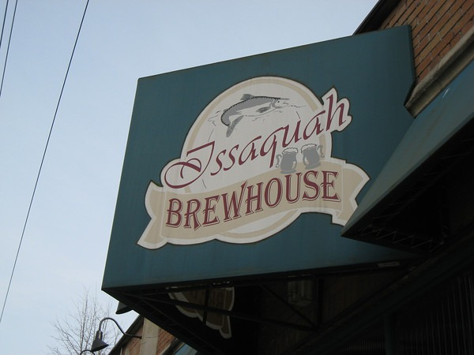

Last night the Eastside Pub Crawlers made it out to the Issaquah Brewhouse. The Issaquah Brewhouse is owned by Rogue. I've been to microbreweries from Maine to Florida to San Diego to Vancouver. This was the ONLY one that I have ever been to that decided it was a good idea to **not** put any detail about their beers on their menu.

We learned from our waitress that it is a Rogue company policy not to list any detail about the beer on their offering sheet. Rogue instead wants the customer to get their beer information directly from the staff. I will say that our waitress was outstanding and knew what she was supposed to know. The problem is when you have 15 people at a table reading an offering of 30-40 beers over a few hours. You either spend your evening interrogating the staff or details get forgotten. Lucky for me I brought a pen and took notes before many members of the group showed up.

Issaquah has some good ales and some sickening sweet ones too. If you decide to go, my advice to to visit their web site and print out the detailed beer reviews, because they will not be available once you arrive.