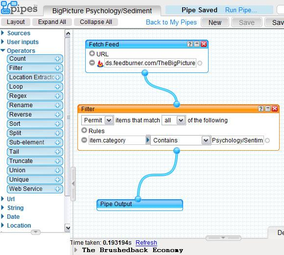

Do you read any blogs that just seem to have too many posts to read? Perhaps you are only interested in reading certain posts. With Yahoo! Pipes you can easily create a custom web page and RSS feed to handle your filtering requests.

1.  Go to Yahoo! Pipes. Get an account if you don't have one.
2.  Select CREATE A PIPE.
3.  On the left side, drag a FETCH FEED module from the Sources onto the grid canvas.
4.  Add the URL of the RSS Feed for the Blog you are interested in filtering. For this example, I will be using the financial blog _The Big Picture_.
5.  Expand the Operators section and drag a FILTER module onto the grid canvas.
6.  Drag a PIPE to connect the FETCH FEED to the FILTER.
7.  Create your FILTER rule. For this example, I am going to PERMIT ALL items that follow the Rule: item.category CONTAINS "Psychology/Sediment".
8.  Drag a PIPE from the bottom of the FILTER to PIPE OUTPUT.
9.  Save the PIPE.
10.  Run the PIPE. Now you will see a page displaying just posts in the Psychology/Sediment category. This page will also have its own RSS feed.
11.  At this point, you can optional publish the PIPE to allow other users access.

 _2015 UPDATE: [Yahoo Pipes! is being shutdown](http://lifehacker.com/yahoo-pipes-is-closing-down-1709067642)_