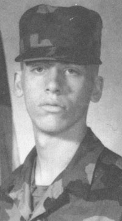

_This is a page I created in 2001 about my military service._

Yes, it's true. MAS served his country. I signed up while still in high school and entered basic training at the age of 17. I was in the Ohio Army National Guard. My MOS was 11 Bravo (light infantry). In my platoon, I was a Dragon Gunner (wire-guided anti-tank weapon). Although our unit was never called up to serve in Desert Storm, a few other Ohio National Guard units did go to the Persian Gulf. Being in the military helped me finance my college education and kept me from having long hair at Ohio State.

_The entrance to Ft. Benning, GA._

_My yearbook photo from basic training._

_Taking Notes_

I completed my 6-year enlistment and received an Honorable Discharge.