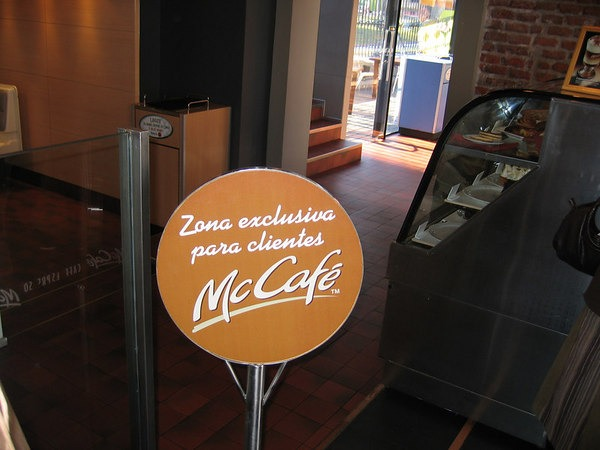

A recent comment from "t" asked the question:

> Which coffee of all the major national chains has the best coffee?

Before I answer let me state that I am an espresso drinker. The only coffee I'll ever order from of a coffee house must come from a Clover machine. Since I am a fan of espresso culture, not coffee culture I must exclude any discussion of McDonalds or Dunkin Donuts. Plus they suck. Coffee must get top billing. From the article [Coffee House Stereotyping](https://ineedcoffee.com/coffee-house-stereotyping/) by Rachel Elliot:

> When you first look into a coffee shop, what is the first thing you see? Is it ice cream, pretzels, flavored coffee, juices, regular coffee, or an espresso-based drink? Nine times out of ten, whatever is most prominently displayed is what they do best. When gourmet coffee or espresso starts looking like a side dish, start looking for the door.

 _McCafe photo I took in Montevideo, Uruguay. McDonalds is my favorite coffee in URUGUAY only!_ Commenter "t" inquired about Caribou Coffee. I haven't been to one in several years so I'll reserve judgement. Most of my coffee experience since 2000 has been with west coast chains. Of the multi-state chains I've been to the clear champion is Peets. The rest are very close, although Gloria Jeans is the worst.

1.  Peets
2.  Seattle's Best Coffee
3.  Coffee Bean and Tea Leaf
4.  Starbucks
5.  Tullys
6.  It's a Grind
7.  Gloria Jean

Note that as good as Peets is, I can name 20 independent places better. Most of the places are in Seattle, Portland and Vancouver. My last comment is that once Starbucks deploys the Clover machine nationally, it will move up my national rankings to 2nd. **UPDATE 2015:** Since this post was written 7 years ago, both Peets and Seattle's Best Coffee have declined in quality. Starbucks has made some improvements. So I'd put CBTL and Starbucks at the top and the rest below. They are all still awful. Seek out a quality local roaster.

---

## Comments

### Kelli
*April 9 at 2008 at 7:07 PM*

Not sure if you were aware, I don't really know the details of when or why.  But Seattle's Best is owned by Starbucks, I believe the acquisition happened a few years ago.

We have a Clover Machine at a local Magnolia shop and I'm certainly impressed with the process...have yet to try a cup.

---

### MAS
*April 9 at 2008 at 7:12 PM*

True.  SBC does have a different espresso blend, which when made properly is better than *$.  Very minor differences.  

I've heard that a Magnolia shop uses coffee from Chicago's Intelligentsia.  You'll have to email me the name.  Another place to go!

---

### MAS
*July 20 at 2008 at 6:25 PM*

Upper Crust Bakery is the place in Magnolia.

---

### Peter
*January 1 at 2009 at 7:40 PM*

You should come east and give Dunn Brothers (MN and the Midwest) and La Colombe (Phila./NYC) a try.  Those are my personal favorite chains.

(La Colombe is barely a chain, however)

---

