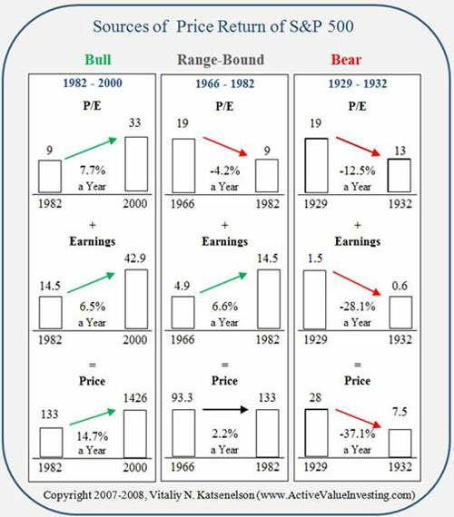

Although there are several good sources on the Internet for financial and economic information, if I had to pick my favorite it would be [John Mauldin's newsletter](https://www.mauldineconomics.com/). The newsletter is free and is sent out twice a week, with John usually writing the Friday edition. The most recent newsletter is titled _Is it a Bull, Bear or Cowardly Lion Market?_ It has some beautiful charts that dissect returns over different time periods. Guest author Vitaliy Katsenelson then extrapolates patterns and characteristics. Prior to reading this article, I was under the impression after reading Ed Easterling's book _Unexpected Returns: Understanding Secular Stock Market Cycles_ that a secular bear market was range-bound. Vitaliy digs deeper into those time periods and then labels it _range-bound_. Interesting stuff.  The best charts can be found over at Crestmont Research. Be close to a high-quality color printer when you see these charts. It is a goldmine of financial data.

---

## Comments

### JOHN
*April 14 at 2008 at 12:26 AM*

A YEAR AGO THE PE RATIO OF THE S&amp;P WAS 17.  TODAY ITS 20.  THE PE RATIO ON THE DOW A YEAR AGO WAS 18, TODAY ITS 52.  MOST BEAR MARKETS LEAVE  SHARE PRICES WITH LOWER PE RATIOS AND THEREFORE  MORE VALUE.THIS BEAR MARKET, FOR NOW, SEEMS TO BE IN RETROGRADE.

---

### Nick
*April 14 at 2008 at 4:31 PM*

And this helps you pick which individual stocks to invest in how?

---

### MAS
*April 14 at 2008 at 4:54 PM*

The author is pushing a book to explain what he believes.  

My personal opinion is it is too difficult to pick individual stocks in a secular bear market.  History tells us to wait on the sidelines or in fixed income investments until P/E ratios over-correct to the downside.

---

