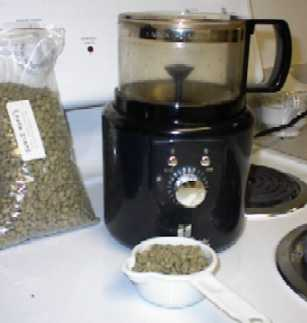
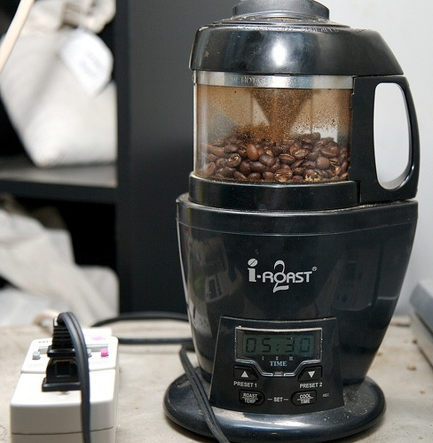

Gather around children, I've got a story to tell about the olden days. Way back in the year 1995 AD, I got my first web hosting account and starting making web pages. I was 100% self taught and still am today. One of the first lessons I learned back in the 20th century on my dial-up modem was the importance of fast page loads.

The way to get a fast page load was to use small grainy images. Monitors were grainy too, so it didn't matter. Or so we thought. A typical [monitor resolution](https://en.wikipedia.org/wiki/Display_resolution) was 640x480 or 800x600 if you spent the money. And digital cameras wouldn't even see a single mega-pixel [image resolution](https://en.wikipedia.org/wiki/Digital_cameras#Image_resolution) until 1997. Add all that up and include the fact that your web host only provided a small amount of disk space and monthly bandwidth allowances and us early web developers found ourselves born and raised in a **Pixel Depression**.

Well we all know happened. Pixels got cheap. Real cheap. Everyone has broadband, endless bandwidth, huge crisp monitors and a bad-ass high resolution digital camera. So we go forth and create better and more media rich content. But unlike Star Trek, we can't go back in time to correct the past.

As I work on the redesign of INeedCoffee, I'm coming face-to-face with these emaciated pixel relics from the past. Below are two photos. The first is of the _Hearthware Precision_ coffee roaster taken by me in 2000. The second is of _Hearthware I-Roast 2_ taken by [Chris Arnold](https://ineedcoffee.com/by/chris-arnold/) in 2007. Night and day.

My _Hearthware Precision_ is long gone, but these hideous photos persist. INeedCoffee has years of bad photos, some of which we are in the process of replacing, but some will be impossible to recreate. The effects of the Pixel Depression are still being felt.

---

## Comments

### Alex
*June 7 at 2008 at 8:20 PM*

I love hearing stories about the Pixel Depression. Families had to scrimp and save just to upload a medium-resolution jpeg back then. Is it true that the New York Yankees used to win championships back in those days??

---

