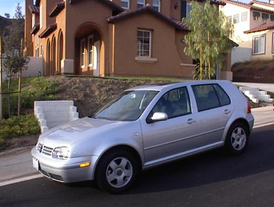

About a week before 9/11, I made one of the most fortunate consumer choices of my life. Although I had already decided to buy a silver VW Golf hatchback, I didn't know if I should get the gasoline or the diesel engine. Having never owned a diesel engine, I was concerned I wouldn't find a diesel pump and I'd run out of fuel and the engine would lock up. My only experience with diesel vehicles were those panic-filled moments trying to return a rented U-Haul truck when I struggled to find a diesel pump.  The reason one buys diesel over gasoline is diesel engines not only last twice as long, but the fuel economy is much better. Here is a quick comparison of the 2001 VW Golf models: City MPG

-   Gasoline: 22-24
-   Diesel: 34-42

Highway MPG

-   Gasoline: 28-31
-   Diesel: 45-49

I chose fuel economy over convenience and bought the diesel. Finding diesel stations turned out to be quite easy. Once you start looking for them, you see them everywhere. I even took a road trip from San Diego through the American Southwest with no problem. Going 600+ miles on a tank of fuel is a nice thing. Well we all know what happened next to the price of fuel. And in the last two years diesel has increased at an even faster rate than gasoline. Diesel is now $5 a gallon here in Seattle. When I tell people I drive a diesel they give me a sad look like my dog just died. Should they be empathetic to me? Let's run the numbers. Here are some rough calculations to determine if I made the correct purchase. Below are my assumptions:

-   90,000 miles driven
-   Average MPG City Gasoline = 23, Diesel = 38 (median number)
-   Average MPG Highway Gasoline = 29.5, Diesel = 47 (median number)
-   Driving ratio = 50% City, 50% Highway
-   Average Gasoline Price 2001-present San Diego/Seattle = $2.80 \*
-   Average Diesel Price 2001-present San Diego/Seattle = $3.00 \*
-   Current Gasoline Price Seattle = $4.25
-   Current Diesel Price Seattle = $5.00

From 2001 - present:

-   Gasoline Fuel Cost = $9600.00
-   Diesel Fuel Cost = $6352.94

On fuel costs alone, the diesel engine saved me $3247.06 so far. And if I used those savings to buy stock in oil companies that number really explodes. :) What about now? Here is the cost to drive 100 miles with today's fuel prices.

-   Gasoline Fuel Cost = $16.19
-   Diesel Fuel Cost = $11.76

So even with diesel being priced 75 cents more per gallon, I'm still way ahead on fuel savings. So please don't cry for me and my diesel engine. I'm crying for you. _\* based off my memory of fuel costs averaged together since 2001_