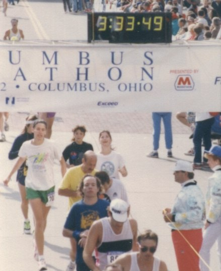

As early as I can remember I've always had a deep interest in nutrition. During college this interest had me pursuing more knowledge on the topic. Having not developed the critical analysis skills I now have I fell for the vegetarian argument. From 1992 through 1994 I was a vegetarian. At the time I believed I was following the nutritionally optimal path.

During those years my body fat dropped to 9%. Good right? Not really. I ran a [marathon in 1992](/2008/03/the-runner-1989-1995/) and if you look at photographs of me during that time period I had dark circles under my eyes. I had yet to start weight training. I was lean and fatigued.

In 1995 I decided to end my vegetarian diet. I was in Florida and training for triathlons. I was tired and protein deficient. My research led to me to the conclusion to add seafood to my diet. And boy did I eat seafood. Everyday. My strength went way up and once again I felt I was following the nutritionally optimal diet.

By 2002 I started reading about ostrich and buffalo. Lean meats that were raised without hormones. I added them to my diet. Every week I would eat ostrich or buffalo. My strength was now at an all-time high and I was able to get my weight up to 210 pounds. And for a third time I felt that my _seafood plus range-fed meat diet_ was nutritionally optimal.

Last year I learned about how farmed fish were being fed grains and how it decreased their omega3 ratio. I also learned about how healthy [turkey](/2007/10/are-these-the-14-superfoods/) was in helping the body process zinc, which keeps us from getting sick. So I dropped the farmed salmon and added free-range turkey.

Now I know there is no such thing as a nutritionally optimal diet. Rules change. New evidence emerges. Even the location of where you are eating will dictate different rules. When I was in [South America](/2006/08/rio-to-buenos-aires-overview/) I tried eating based upon my optimal nutrition rule set and got sick. In Brazil and Argentina cattle is grass-fed and the seafood may come from highly polluted water. You are better off eating beef there and wild seafood here. In Cuba and Vietnam, pork may be your best option.

I just finished reading [The Ominvore's Dilemma](/2008/07/the-omnivores-dilemma/) and it seems that my many year journey with food has brought me to one of the conclusions the author had. It's not so much what you eat - but what the thing you are eating ate. A fish or cow fed grain is a not a natural food. It's not enough to say one food is better than another, but to look closer and see how natural that food is. Finding cleaner and more natural sources of food is my only goal now. No more rules.

---

## Comments

### dhammy
*July 18 at 2008 at 1:19 PM*

MAS,

The omnivore's dilemma is a great read and truly enlightening about the insanity of our highly processed food system, the dominance of corn in our diet, etc.  I read his followup book, In defense of food, a few months ago and highly recommend that one as well.   He presents a wonderfully simple and small set of rules for choosing our foods. 

FYI, I did the vegetarian thing myself for about 5 years (96-01) and found it unsatisfying/wanting.  Since then I've added poultry and occasional seafood.  I've been pondering adding buffalo and grass-fed beef myself but overall I'm satisfied with my diet as it is today.

---

### MAS
*July 18 at 2008 at 2:08 PM*

DHammy 
As a Columbus resident, go to Ted's Montana Grill and try a buffalo burger (med-rare).  I wish we had that restaurant on the West Coast.  I get the one with mushrooms and swiss whenever I'm back in town.

I have IN DEFENSE OF FOOD on deck.  First I need to read a coffee book for the August issue of INeedCoffee.

---

### dhammy
*July 18 at 2008 at 5:41 PM*

It's difficult to go back to eating red meat after not having touched the stuff for 11+ years.  We'll see.

In defense of food probably won't shed a great deal of light on anything for you as you already seem to eat healthy.  But it's a very entertaining read.  The best part of the book is the first half or so which is a rant against the non-science of 'nutritionists' and 'nutritionism' and the amazing pack of lies, half-truths, and mis-information we've been continuously fed over the last few decades.  You'll enjoy it.

---

### XROLOL
*October 5 at 2012 at 1:03 AM*

I like your conclusion. Very zen. Also flexible and smart; there's some wisdom in your conclusion.

---

