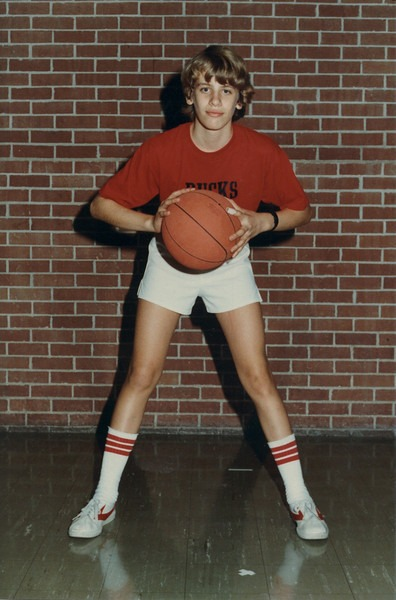

When I was a kid one of the sports I participated in was basketball. It suited me a lot better than soccer or baseball. Although I was never a great player it was a lot of fun. Once I got to college one of my many rentals was a house that had a slab of concrete in the back. It was supposed to be a foundation for a garage or something. But it never got built so me and my roommates (_including frequent commenter Dhammy_) built a basketball court. We played all the time. After we moved got evicted from that place I stopped playing. Last year I started reading Arthur De Vany's work on Evolutionary Fitness. He is a big fan of basketball playing as an ideal exercise. Here is what he stated in his original thesis:

> Pro basketball is not an aerobic sport, it actually is an anaerobic sport full of power moves, quick bursts, sprints, and leaps mixed in with half time rest, quarter breaks, pauses, free throws, time outs, and bench time. What NBA players have is the ability to use these brief intervals to quickly recover their phosphate energy stores (they use the alactic pathway discussed below). NBA athletes and NFL defensive backs provide evidence that power law training makes you powerful and lean. NBA players are the leanest and most powerful in any professional sport (their body fat is around 5 to 7 percent).

In a nutshell, basketball is the anti-treadmill. It is anything but steady state aerobics and because of the pacing basketball players are the leanest. While walking around my neighborhood I noticed there were some basketball courts behind the school next to my building. Nobody is ever using them and the gate is never locked. So I bought a basketball today and ended my basketball retirement. It sure beats driving an hour to hike up a mountain. :) 

---

## Comments

### dhammy
*July 29 at 2008 at 1:07 PM*

I remember some pretty intense games back there on that slab of concrete.  But the funniest story related to the basketball court was when some little punks from the neighborhood attempted to steal the entire goal.  I vaguely recall that we busted 2 or 3 of them trying desperately to drag the whole structure down the alley?

Basketball is an awesome sport for overall fitness and I agree with the analysis.  All that jumping can be somewhat hard on the back, though.  At 6'3" you may not have to jump as much as the rest of us, though ;)

D

---

### MAS
*July 29 at 2008 at 1:38 PM*

In addition to busting the punks, the other story I recall is how odd it was that the guy known as GATOR always needed to take a shower BEFORE playing a game of hoops.

---

### dhammy
*July 29 at 2008 at 3:09 PM*

Good times...  I recall that night some guy was shot in the alley right back there too.  Apparently a drug deal gone bad but who knows.  Glad we weren't out playing hoops that night!

I like swimming for the occasional workout as well.  Doing a couple sets of fast laps will get your heart pumping and remind you of muscles you didn't know that you had.  And you have to appreciate the low-impact nature of the sport.  Does De Vany have anything to say about it?

---

### MAS
*July 29 at 2008 at 3:25 PM*

I don't recall much discussion on swimming.  The other sport he likes is tennis.  I suppose if one is constantly altering their pace and stroke then swimming might be more effective than steady-state endurance swimming.  I'm not sure on this one.  

I haven't swam in years.  When I did and the water was cold it always leaned me out quickly.  The colder the better.

---

### Matt
*July 29 at 2008 at 5:52 PM*

I agree. My top 2 (outside of weight lifting of course) are: tennis and swimming ... I used to say basketball also but the games just got too competitive/aggressive for my tastes these days (and you can play tennis, at least doubles tennis, and swim all your life for the most part ... I've played tennis with/against guys well into their 80s ... crafty f!@#%ers). You have to factor in your personality also. Swimming is great for someone like my wife who has hip issues and prefers being in a tranquil, solitary state when exercising whereas I like the social aspects of tennis (I get my solitary needs taken care of with weight lifting ... I go when the gym is usually pretty empty ... you can certainly shoot hoops and do some drills by yourself -- also hit balls with a ball machine, but both get real boring to me pretty quickly). Tennis also tends to attract less 'aggressive' folks than basketball in my experience ... great networking at my club is done on the tennis courts as well ... I play 2-3 times/week and it's doubles usually and mostly social and most of the guys are in their 50s, but I still get a great workout in because I've gotten better and they are REALLY good ... long rallies, quick runs to the net, back to the baseline for lobs, etc, and if you are really good you know to always be moving, bouncing on your toes, getting ready for the next shot, etc ... and I also rarely play more than one hour/2 sets max (actual exercise time is probably 30 minutes between all the pauses, etc).

Matt

---

### Paul
*July 29 at 2008 at 7:43 PM*

I loved playing basketball in high school, always left you winded. But now my main sport activity is racquetball, which i think equates to tennis in overall fitness level required. I sweat more in a game of racquetball than i ever did playing basketball, running track or playing baseball. My onl;y problem is finding people to play with

---

### ken
*January 19 at 2024 at 9:27 PM*

this is how boys are supposed to dress today!!!!!!!!!!!!!!!!!!!!!!!!!!!!!!!!!!!!!!!!!!!!!!!!!!!!!!

---

