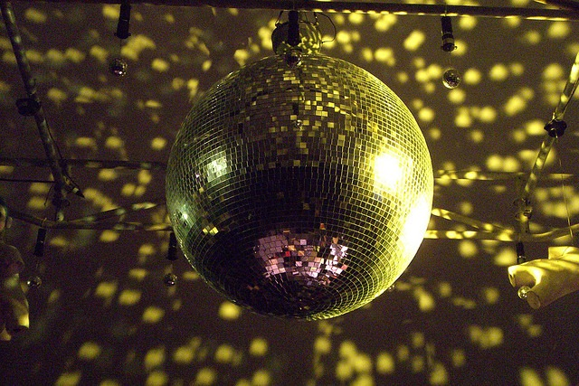

The one thing I am most kidded about is my early bedtime. I have the sleep habits of a middle-schooler. On a typical night, I'll go to bed between 10 PM and 10:30 PM. Then I rise between 5:00 AM and 6:00 AM without an alarm. Yes, I am an unapologetic morning person. Although waking up early and being productive is a highly valued attribute for a family man, it is a disadvantage to a single guy. It seems other single people do like _the night life_. By 11 PM, I look like a kid in the back seat of a car returning from a day at the amusement park. Of course, this fact provides an endless source of amusement for my friends. So I decided to investigate sleep. I'm only 30 pages into the book _Sleep by Carlos H. Schenck_ and I've already learned a few things.

> ...it appears that the tendency to be a "morning person" or "night person" is something we are born with. We all have unique biological needs and do our best when we accept them instead of forcing ourselves to fight them.

There is also a type of insomnia called _early-morning awakening_. It occurs when the sleeper wakes up too early. I may have this and have learned to deal with it by going to sleep earlier. Or maybe I just wake up each morning with a lot of things I want to accomplish and after a full day of working on them, I get sleepy.  _[Disco ball](https://flic.kr/p/2TSXHi) by Carol Nichols_

---

## Comments

### Warren
*August 13 at 2008 at 2:37 PM*

Being a club DJ from the mid 1970's to past 2000 I had been beyond a night person. I would often fall asleep as the sun came up and wake long after the crack of noon. For the past few years I have been waking up at 5AM for work and like you I get sleepy at around 10PM. There are nights that I will crawl into bed before 9PM and fall right to sleep. I now can not sleep in past 8AM no mater how late I stay up. This would be proof that you can teach yourself to be a day person or a night person if you really want or need to.

---

### Notch
*February 27 at 2023 at 5:36 PM*

This describes me in recent years as well.  I used to be more of a night owl but now I much more appreciate getting up early and well rested.  It was a gradual process for me as I focused on getting at least 8 hours sleep and a consistent bedtime.  Over time, I went to bed earlier and earlier.  Now I normally wake up by 6am without an alarm and I enjoy the peace &amp; quiet of early morning.

---

### MAS
*February 27 at 2023 at 11:38 PM*

@All - This post is now 15 years old. I'm going to bed and waking up even earlier. 9p-4a is common now. Works for me.

---

