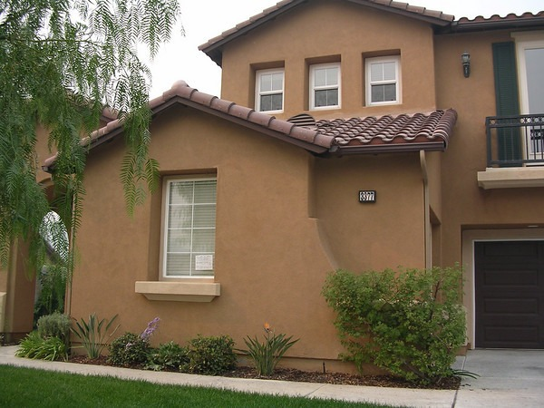

In the post [Irrational on the Way Up, Rational on the Way Down?](/2008/08/irrational-on-the-way-up-rational-on-the-way-down/), I touched on the psychology of would-be home buyers that watch prices drop faster than they can save money. Saving money and delaying purchases will become more and more popular. Meanwhile, the inventories of unsold homes will continue to increase. Besides psychology and high home supply, there is another reason why home prices are going to fall further. **Lending is about to get very tight.**

When I bought my first home in May 2001, all I needed was a 5% down payment. I had saved enough money to put 10% down, but I didn't need it. And since I served 6 years in the Army National Guard, I was also eligible for a military lending program, but I didn't need it. The bank that underwrote my mortgage liked my credit score and salary. They felt a 5% down payment protected them.

As real estate prices rose, the banks decided they no longer needed a 5% down payment. If the underlying asset is appreciating at such a fast rate then - if the owner defaults - they could always sell the house at a profit.

Then the banks got really stupid and started writing loans without proof of income. They wanted the fees and again they could always resell the home at a profit if the owner defaulted because real estate can only go up. Right? Wrong.

Well, we know what happened next. Waves of foreclosures and banks taking back properties they can not sell. The inventory on the MLS is getting larger while the REO (bank-owned) shadow inventory is growing at an even more rapid pace. In a video earlier this year, _Mr. Mortgage_ stated that 97.5% of all homes for sale at auction are being taken right back by the same bank - because the bids are too low.

The music will stop. It already stopped for IndyMac. Other banks will fail. When they do, more inventory will be dumped onto the market. But this post isn't about inventory, it's about lending.

Lending is about to get very tight. Not a little, but a lot. The days of 0% down are gone. The days of 5% down for many markets will be gone as well. _Mr. Mortgage_ reports that Fannie/Freddie is moving to a [10% down payment requirement](https://web.archive.org/web/20160418192042/http://mrmortgage.ml-implode.com/2008/09/01/say-goodbye-to-95-fanniefreddie-loans-10-soon-to-be-required/).

> Requiring an extra 5% down in the hardest hit states will take many potential buyers out of the market. This would be yet another blow to fragile markets around the nation. Fannie and Freddie are handling some 75% of all loans in the US now and even a seemingly slight tightening of guidelines can have devastating effects.

10% down may be just the beginning.

We know savings are very low in this country right now. Perhaps nearing an all-time low. **Huge inventories + no savings + stricter down payment requirements = Big price reductions are coming.** How will banks respond to underwriting mortgages when their underlying assets keep falling in value? They will either ask for proof of a higher salary or more likely demand a higher down payment. The bank will not want to be underwater should you walk away from the home. A larger down payment protects them should you decide to walk away.

Are we going back to the days of 20% down payments? If we are, what kind of house can you afford? The prices of homes today are based on the expectation of easy credit and low down payments. What makes a $700,000 home worth $700,000? Is it no proof of income and a 0% down payment? Or is it 3x income with a 20% down payment? Something needs to correct or this equation doesn't work. Prices have to come down.

I've said it before and I'm sure I'll repeat it. In a deflationary environment, cash is king. If you want to buy a house, save your money, because the bank may not loan you all you need.

---

## Comments

### dhammy
*September 4 at 2008 at 2:47 PM*

10% down should always have been the bare minimum.  If you want a $700k house and you can't save $70k then here's a news flash for ya: You can't really afford a $700k house!  This is regardless of income level.  It's a lifestyle/personality limitation.

I agree with you for the most part, though.  Prices should be coming down substantially in the most inflated areas of the country.  Other areas will be flat at best.

---

### MAS
*September 4 at 2008 at 2:50 PM*

Agreed.  The areas with the most unsound lending practices that had the most appreciation will get smacked the hardest.  (SoCal, Florida, Vegas)

---

### Matt
*September 6 at 2008 at 8:29 AM*

10%?!? Wow, what bank is offering that? All conventional lenders want 20-25% down for most commercial deals I'm doing. Of course, you increase your cash on cash by getting the sellers to carry back some of that, but still ... I look forward to the day in the not too distant future when all my financing is with private money and no banks are involved at all.

---

### MAS
*September 6 at 2008 at 1:37 PM*

All my real estate posts are about residential.   5% down has been a standard for years.  Raising that requirement to 10% by Fannie/Freddie will cause residential prices to collapse further.

---

