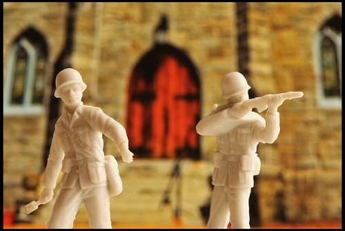

Last week, I brought the [coffee group](https://www.meetup.com/seattle-coffee-club/) to a new venue. The turnout was great and everyone seemed to have a great time. Or so it seemed. On Friday, I received the angriest vile email directed at me and the group from an employee of the place we went to. Considering just 3 days ago in the post [Tales From the Glitter Gym - Nonsense](/2008/09/tales-from-the-glitter-gym-nonsense/), I wrote "_One of the biggest lessons I've learned in life is that we can't control the actions of others - only our reactions to those actions."_, I was about to be tested.  _Photo [Defending the Doors of the Church](http://flickr.com/photos/benmcleod/413429933/) by FLICKR user Ben McLeod_ **Phase 1** My first reaction was anger. The email was a direct shot at me and full of lies. When I go into a Seattle coffee shop I often get the Sinatra treatment. To be attacked was new to me. My angry feelings had me thinking about my connections in the city and how if I pushed it, I could make the writer of the email pay. But I did not react. I decided to chill for a few hours. **Phase 2** My second reaction was to go on the defense. I could deflect the personal attacks and instead, go point by point and present a defense for each charge. But I did not react. I decided to wait a few more hours. **Phase 3** My third reaction, after seeking counsel from a friend, was to _take the bullet_. A general apology on behalf of the group might be enough to keep the peace. Ignore the bitterness and respond with positivity. But I did not react. I decided to wait a few more hours. **Phase 4** My fourth reaction was a recognition that my attacker was unworthy of even a peaceful resolution. You can't win everyone over. She clearly had anger issues that went beyond her job. The coffee place we went to was not a top tier place, so avoiding it will be easy enough. In the end, I decided to ignore the email and move on. As I moved through each Phase, I started to feel better. I'm almost glad I got the attack email. It was a powerful learning exercise. Longtime readers of this site, who read my old blog _Chicken Soup For the Rectum: A Web Log for the Unsympathetic Soul_ (2000-2004), are probably stunned with my peaceful response. Maybe I'm getting too soft.

---

## Comments

### Jim
*September 8 at 2008 at 8:54 AM*

Two words:  Socratic Method

That is how I respond to e-mails like this.  I ask questions ...I write the questions in a completely emotionless manner ...no sarcasm, no anger. 

Write it and come back an hour later to review.  Rewrite to remove any remaining emotion and further explain any gaps that might be there.

This is a great tool to use with bosses or co-workers also.  It shuts down the BS quick and allows you to voice things that you otherwise might not.

2500 years old, but powerful sh*t!  It is particularly powerful with the presence of lies or hidden agendas.

Description:  https://en.wikipedia.org/wiki/Socratic_method

---

### Jenn,
*September 11 at 2008 at 5:14 PM*

No surprise...  It's called growing up :-)
Some people just want to be angry. It's a choice, just like your peaceful response was a choice. And if the person is not someone that you care about having in your life, then its really not worth expending ANY energy on.

---

