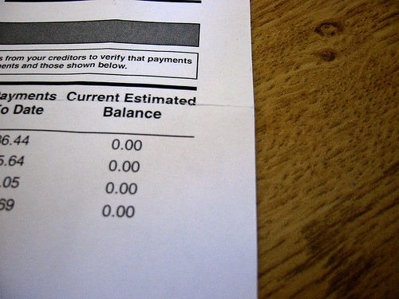

Considering last week was my most profitable week ever investing, it wasn't surprising that a few people approached me with questions on investing. It should be noted that although I'm doing great right now, I was dead wrong on equities in 2006 and oil in early 2008.

I'm not an investment professional, nor do I want to be. I'm a [contrarian](https://en.wikipedia.org/wiki/Contrarian) by nature with an interest in financial history and investor psychology. In today's market, that seems to be the special sauce. Yet I'm not arrogant enough to believe I have everything figured out. Financial history has a long list of highly successful investors that [died penniless](/2008/04/reminiscences-of-a-stock-operator/).

With those caveats behind me, here are my thoughts about what one should do before they begin investing.

I have different thoughts on 401k investing, so this post is just about post-tax investing. **Before you consider post-tax investing, I think you should be 100% debt-free (except mortgage) and have 6 months of expenses saved and readily available in a savings or checking account.** This will disqualify the majority of people.

If you have credit card debt, owe money to friends, or still have car payments, you should tackle those debts first. I would also include any student loan debt unless you are getting tax deductions on it. The reason for this is when you invest there is a risk associated with achieving an expected return, but there is no guessing the amount of interest you will be paying on your debt. So if your credit card carries an 11% interest rate, paying that debt off early is a sure savings, whereas investing is always going to carry risk.

_Photo [Out of Debt](http://flickr.com/photos/garrettc/16438119/) by FLICKR user Garrettc._

This is the sequence on how I would pay debt:

1.  All minimum payments first. You never want to incur a late or missing payment fee.
2.  Friends and Family. Although these loans tend to be interest-free, I would pay them back next. Citibank isn't going to bail you out of jail or donate a kidney to you. Your friends and family might. Don't let a money issue ruin a relationship.
3.  Highest interest rate to lowest interest rate. Throw all guns at the highest interest rate debt. Everything else should get the minimum payment. The only exception here is if a debt is within striking distance of being paid in full.

In addition to being debt-free, I also think it is comforting to not live paycheck to paycheck. Having six months of expenses saved up brings such piece of mind. For almost a decade I've had at least six months of savings in my checking account. If an employer ever mistreated me, I had the freedom to walk at a moments notice (and I have).

If more employees had 6 months of savings, my guess is employers would treat their workers much better. I picked six months because it allows enough time to look for a new job, even move across the country and take a mini-vacation while you can. ;)

OK, so you are debt free and have six months of savings, how shall one go about investing? More on that in the [next post](/2008/10/investing-101-the-biggest-lesson/).

---

## Comments

### Jim
*October 6 at 2008 at 8:11 AM*

I generally agree with your post, but I have non-mortgage debt I choose not to pay off even though I could.

My income is too high to deduct my student loan debt, but the interest rate is fixed at 2.75%.  

Why pay myself 2.75% when I can earn much more?

---

### MAS
*October 6 at 2008 at 1:54 PM*

I thought about that what I wrote that, but for most people that haven't started post-tax investing, paying down debt - even at low interest rates - gives them time to educate themselves.  

People that are already confident in their investing knowledge, like yourself, can alter this step with a simple calculation.  

Another thing about student loan debt is that although one may not qualify for tax deductions today, a job loss or salary reduction could mean they qualify for deductions in the future.

---

### Matt
*October 6 at 2008 at 3:46 PM*

Thanks, MAS. Very good post. I really respect how you've educated yourself (the #1 rule in investing: "invest in what you know" which, of course, presumes knowledge first .... my favorite quote: "there's no such thing as a risky investment, only risky investors" ... what mostly governs SEC regs).

Anyway, I think this is solid advice for salaried employees. Of course, the next discussion would be investing for business owners (pre-tax investing) where the rules are quite a bit different (although the savings and low to no 'bad' debt philosophy still stands and one in which I completely agree ... of course, in business, this is called reserves and debt instruments can be a very valuable leverage tool IF USED PROPERLY). I know I'm beating a dead horse here, but generally my opinion is the best investing is via building your own business for numerous reasons: more control over your life (financial and, more important, time), better tax rules, better investing options (pre-tax), and generally more diverse financial instruments available than to the typical employee.

---

