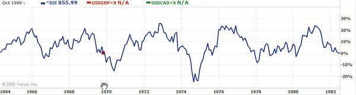

This post is a follow-up to [Investing 101 - Before You Invest](/2008/10/investing-101-before-you-invest/). The biggest lesson I've learned in the last few years is what I call the _Baby Boomer Lie_. I've covered this on other posts, so forgive me for repeating it. Baby Boomers were fortunate enough to enter their high-income years early in the 1982-2000 bull market. Even the 1987 crash could not derail this bull market. Everybody was making money. You couldn't lose. Stocks went from boring investments to winning lottery tickets. Look at the DJIA (Dow Jones) chart from 1982 - 2000. The lesson that I refer to as the Baby Boomer Lie was that stocks were not only safer investments but that they can be expected to generate a higher rate of return than other investments. Although it was true from 1982-2000, this investing wisdom is not always true.    The gurus of that era wrote books and some got gigs on TV. They became our financial mentors. Unfortunately, they have a jaded view of history. Once stocks have a high valuation, as measured by the P/E ratio, the average expected return falls below fixed income, and the probability of a major price correction increases. In my opinion, today's market resembles the choppy market of 1964-1982. Learning investing from the bull market gurus is going to be painful in this market.  No one post can say everything about investing. It is far too complicated of a topic, but if I were to recommend one single book it would be _Bull's Eye Investing: Targeting Real Returns in a Smoke and Mirrors Market by John F. Mauldin_. Mauldin does an amazing job of explaining investing. The last few chapters are about picking a hedge fund and can be ignored by most readers. John Mauldin borrows information from Ed Easterling. If you prefer a more academic book on investing, then read _Unexpected Returns: Understanding Secular Stock Market Cycles by Ed Easterling._ I enjoyed both books but preferred Mauldin's writing style. John Mauldin also has an email financial newsletter that I highly recommend. He writes one per week and then has a guest writer write a second one. Although the guest writers vary widely, the one John puts out Saturday morning is the single best weekly financial analysis that I currently read.

---

## Comments

### Matt
*October 11 at 2008 at 9:05 AM*

http://web.archive.org/web/[phone removed]5238/http://www.magneticsponsoring.com/1009magnetED.mp3

He predicted this in 2005. Read The Prophecy.

Matt

---

