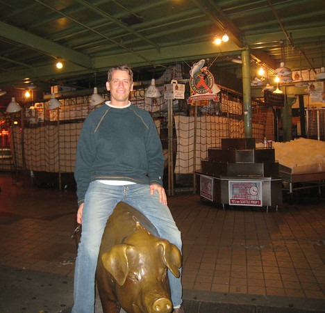

Here are two photos taken of me last Saturday evening on the Pike Place Market Pig. The pig is in front of the area where the guys throw fish. This was after the market closed, which explains why there are no people or flying fish in the background.

After reading the Wikipedia page, I learned the pig is named _Rachel_.

> Pike Place Market's official mascot, Rachel, a bronze cast piggy bank that weighs nearly 600 pounds, is located at the corner of Pike Place under the "Public Market Center" sign. Rachel was designed by local artist Georgia Gerber and modeled after a pig (also named Rachel) that lived on Whidbey Island and was the 1977 Island County prize-winner. Rachel receives roughly $9,000 USD annually in just about every type of world currency, which is collected by the Market Foundation to fund the Market's social services. Locals make a habit of emptying their pockets and rubbing Rachel's snout for good luck.

I knew a Rachel back in Ohio. Striking resemblance. :)

---

## Comments

### Matt
*October 9 at 2008 at 10:10 PM*

I love the serious look on your face in the second one. Dude, YOU'RE SITTING ON A PIG STATUE! There's nothing serious about it! ;-)

---

