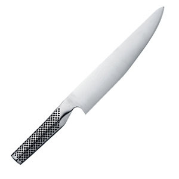

Here is a mini cooking update. I bought my first REAL kitchen knife. It is a [Global](https://en.wikipedia.org/wiki/Global_\(cutlery\)). Yeah it was $90, but it is so much better than any other knife I've ever used.

My curries are getting better. My first attempt at Pad Thai was almost inedible. And my Russian Borscht soup was good. That is all for now.

---

## Comments

### Nick
*October 9 at 2008 at 6:52 PM*

I'm saving up for this one.

https://www.amazon.com/gp/product/B000NLUPNS

---

### Melissa
*October 11 at 2008 at 2:06 AM*

Ooh, nice! I really liked the Global when I tried out knives, but we ended up with Henckels Pro S. I'm not sure why, considering I'm the one using them 87 times a day....but I digress.  :p  A really good knife that fits you well is indispensible!  Enjoy!

---

