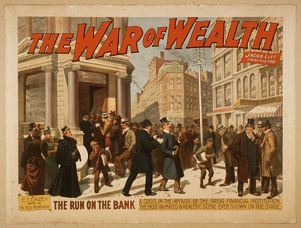

On Monday, when the market crashed, I was away from my computer. I missed the entire event. In fact, I was having lunch with _Market Man,_ who is also bearish on the market. While most investors had their ass handed to them, my portfolio set a single-day record. Of course, a single day is just noise, which is why I gave back half my gains from Monday the very next day.

The direction for the stock market indexes is down, but the path is not straight.

_From FLICKR user pingnews.com ["The War of Wealth" by Strobridge & Co. Lith., ca. 1895 (LOC)](http://flickr.com/photos/pingnews/2868382770/in/set-72157594178798376/)_

Bear markets are brutal. [Buy and hold strategies](/2008/03/investing-in-stocks-for-the-long-term/) will seriously damage you in a secular bear market. If you do not feel comfortable shorting the market, whether directly or in a [managed fund](/2008/03/bear-market-investing/), the best place to be is in a fixed income fund. Return of capital is more important now than return on capital. Your goal should be to have cash at the bottom.

---

## Comments

### Nick
*October 1 at 2008 at 8:30 PM*

So Warren Buffet should abandon his buy and hold strategy?

---

### MAS
*October 1 at 2008 at 8:34 PM*

Always going back to the Buffet example?  Buffet ACTIVELY works with the management of companies he directly invests with.  This is not an option for the typical investor.  

The typical investor gets to select managed funds for their 401K.  History and probability dictate that fixed income will outperform equities at this stage in the economic cycle.

---

### Matt
*October 1 at 2008 at 10:49 PM*

Yes, active investing indeed is the key. Let's just say Christmas came early in the Pitcher household on Monday as we were yelling "buy! buy! buy!"And, I don't even know anything about the stock market (my game is commercial real estate), but I do know the golden rule to investing: buy low, sell high (contrarians win, lemmings lose). The second rule is: only invest in what you know (there's the real lesson from Buffett). These 2 lessons are the only ones you need to know ... okay, school's over, back to work!

---

### Jim
*October 2 at 2008 at 5:58 AM*

In addition to MAS's comment, if Berkshire suddenly "went to cash" it would crash the market.  Buffet HAS to hold most of the potfolio ...he doesn't have to buy though, which is why he has build up a huge cash reserve.  He has been dipping his toes in the water lately, but he hasn't gotten serious yet.

Also, here is a really well written article that expands on MAS's topic:
http://www.financialsensearchive.com/Market/barbera/2008/0930.html
I like Barbera ...he has a weekly article and is usually spot on.

Finally, I'm beating a dead horse here, but try buy and hold over the following indices/periods:
- DOW - 1929 to 1954
- DOW (or S&amp;P) - 1965 to 1980
- NASDAQ - 2000 to ????
During these 25, 15 and ?? year periods these indices were FLAT!  Worse, they don't even account for inflation!  If inflation was 3% a year, then a 1929 dollar in 1954 is really worth about 50 cents.

---

### MAS
*October 2 at 2008 at 8:44 PM*

great link Jim!

---

### MAS
*October 2 at 2008 at 8:52 PM*

Convincing people that buy-and-hold strategies are idiotic in secular bear markets is almost as difficult as convincing people that steady-state aerobics are ineffective for fat loss.

---

### Jim
*October 3 at 2008 at 5:30 AM*

Buy and hold is like driving a speedboat in a straight line and convincing yourself that there is water again after that patch of land ahead...

Buy and hold for Buffet is like steering an Air Craft Carrier ...you'd better know where you are going and give yourself plenty of time to turn.

---

