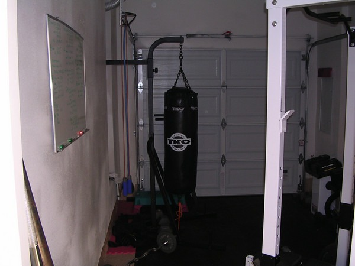

Back when I had a home gym, I kept records of each workout. After a few injuries and the move, I stopped recording my numbers. Well I've had some good progress this year, so I revisited the article [Are You Strong?](https://web.archive.org/web/20150316202627/http://www.t-nation.com/readArticle.do?id=1563264) by Tim Henriques. The writer breaks down many of the core exercises into decent, good and great categories.

_Notice the white board on the left. I used that to record my workouts._

I really don't have the desire to go back to the days of recording every set. However, I have decided that I desire to be decent. In honor of this new quest, I have setup a new page on this site called Training. Here I will update the table as I meet new targets.

Today I qualified as _decent_ in the military press, skull crusher and push-ups. I came up 2 reps short on the dips.

NOTE: The numbers on my Training Page are for men. To see the numbers for women, visit [the article](https://web.archive.org/web/20150316202627/http://www.t-nation.com/readArticle.do?id=1563264).