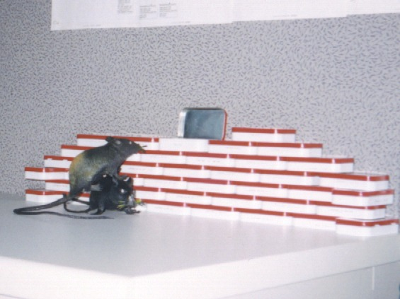

Back when I worked for Nielsen Media Research in the 1990s, I loved Altoids. I still love Altoids, but nearly as much I did back then. During the dot-com days, I would go through almost a full tin a day. Some guys became drug addicts or had gambling problems. My vice was Altoids.

Instead of throwing away the tins, I started piling them up on my desk. Then after one eventful Halloween, I found myself in possession of two very real looking plastic rats. I decided to have a little fun at work. I set up this display of tins and made it look as if the rats were teaming up to get at them.

Needless to say, it freaked more than one of my fellow co-workers out. Before long people from other departments were coming over to view the Altoid Rats.

---

## Comments

### Joe
*November 17 at 2008 at 4:04 PM*

Funny!

Leah's working on crafts these days -- some of which involve Altoid tins. Do you still collect them?

---

### MAS
*November 17 at 2008 at 4:48 PM*

Nope.  They never made it West of the Mississippi.

---

