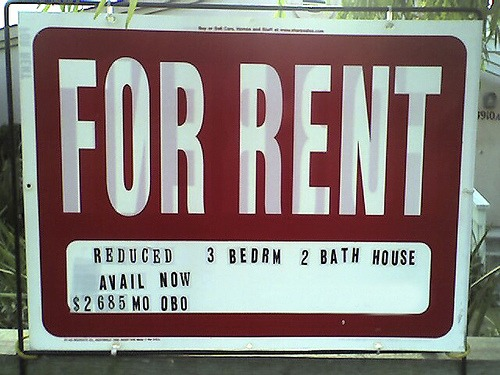

Yeah, home prices are falling. That is old news. I'm more interested in what is going on in the rental market. When I went looking for a rental unit back in May, there was little offered and the prices were somewhat higher than I would have liked.  _Photo For Rent - Reduced??!! by Flickr user Kelly Sims_ Since moving to the Upper Queen Anne area of Seattle in May, I have noticed more and more places available for rent in my neighborhood. Places with FOR RENT signs that filled in days, now have the sign out for weeks. I was talking with MarketMan about this recently and here are our thoughts.

1.  Younger adults are staying longer or moving back in with their parents. As job opportunities for recent graduates dry up, it is becoming more acceptable to stay with mom and dad for an extra year or two.
2.  Getting a roommate is becoming more popular. With sites like Craigslist, it is very easy for homeowners struggling to make mortgage payments to rent out a room. The renter saves money and doesn't enter the traditional rental market.
3.  Homes where the owner can't sell, become rental properties. During the boom, people bought multiple properties with flipping on their minds. Now, these properties aren't selling and often sitting empty. Some owners are giving up on the prospect of selling and are putting these houses into the rental market.

Less demand and increased supply appear to be softening the rental market in my neighborhood. How about yours? Where do you live and what are you seeing?

---

## Comments

### TigerAl
*November 30 at 2008 at 11:02 PM*

I have a townhouse on Issaquah Ridge, east of Seattle.  Most of the properties that were for sale in my community (and were on the market for a while) are now available for lease, #3 on your list.

---

### KirkH
*December 1 at 2008 at 1:32 AM*

4.  Retirement is about to hit millions of baby boomers.  Those boomers' nest eggs (home equity &amp; 401ks) have been stepped on.  As boomers migrate back to the homes of their children they will leave empty homes in their wake.  Reverse mortgages are an option but with home equity shrinking they are a less attractive option.

---

