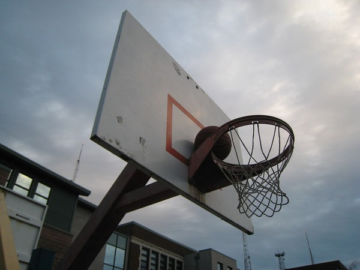

For the second time this month, my basketball got stuck behind the rim. The first time it happened I thought it was the freak event of the year. Then it happened again today. Perhaps it has something to do with the cold weather?

I can [bench press my weight](/2008/11/the-quest-to-be-decent-part-3/) and do [20 consecutive pull-ups](/2008/11/the-quest-to-be-decent-part-5/), but this white man can't jump. I was unable to get the ball via vertical leap. In order to get it down, I use the _"remove a shoe and fling it"_ strategy. The shoe was able to hit and free the ball without getting stuck itself.

---

## Comments

### TigerAl
*December 1 at 2008 at 4:19 PM*

Just had a thought though it is more of a theory that needs validation :):  The cold could have caused the metal bolts fastening the hoop to the backboard to contract, tightening them further.  Over-tightened bolts would tend to tilt the hoop upwards which could explain why the ball gets stuck behind it.

---

### MAS
*December 1 at 2008 at 5:04 PM*

Excellent analysis.  It is so nice to have a PhD commenting on my site.

---

### TigerAl
*December 1 at 2008 at 5:36 PM*

Actually, this analysis is more a result of having assembled a lot of furniture in warm as well as cold weather and over-tightened quite a few bolts in the process :)

---

